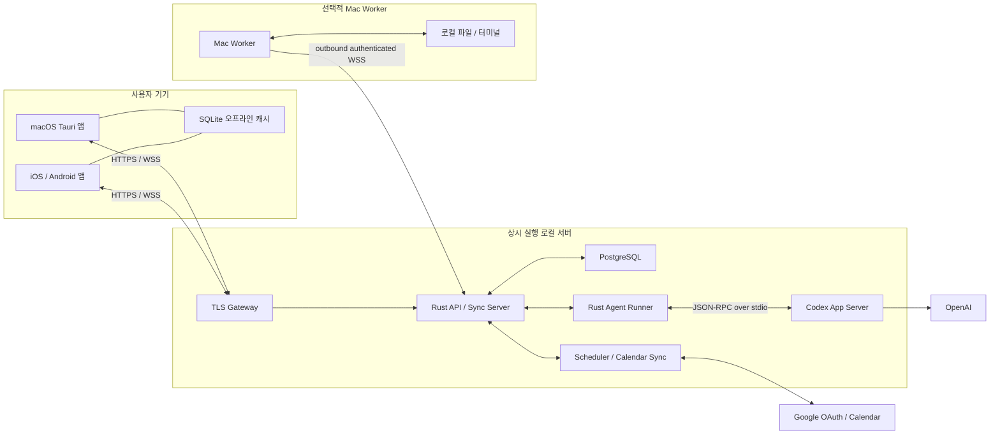

# Jimin OS 전체 개발 계획

> 기준일: 2026-07-10
>
> 상태: 구현 전 계획
>
> 목표: 로컬 서버에 배포하고 Mac과 개인 휴대폰에서 실제 검증할 수 있는 `v0.1`

> 2026-07-11 정정: 이 문서의 초기 Google OAuth 기반 앱 로그인 계획은
> [ADR-0004](adr/ADR-0004-device-pairing-app-identity.md)로 대체됐다. 현재
> 앱 접근은 QR 기기 등록과 Jimin OS session으로 처리하며, Google OAuth는
> M2 Google Calendar 연결에만 사용한다. ChatGPT 계정은 개인 서버의 Codex
> App Server가 별도 managed device-code 로그인으로 관리한다.

## 1. 제품 목표

Jimin OS는 개인의 일정, 할 일, 프로젝트, 결정과 대화를 한곳에 연결하고 과거 맥락을 현재 판단과 다음 행동으로 이어 주는 개인 AI 운영체제다.

첫 버전은 다음 질문에 답할 수 있어야 한다.

1. 오늘 일정과 우선순위는 무엇인가?
2. 과거에 이 결정을 왜 내렸고 현재도 유효한가?
3. 다음으로 해야 할 행동은 무엇인가?
4. 필요하면 어떤 작업을 실행할 수 있으며, 사용자의 승인이 필요한가?

일정과 개인 데이터는 Mac 상태와 무관하게 접근할 수 있어야 한다. Mac은 시스템의 본체가 아니라 로컬 파일과 터미널 작업을 제공하는 선택적 실행 노드다.

## 2. 전제와 기본 결정

로컬 서버의 정확한 OS와 CPU는 구현 착수 시 확인한다. 계획은 다음 조건을 만족하도록 구성한다.

- Linux 기반 로컬 서버
- Docker와 Docker Compose 사용 가능
- `linux/amd64`와 `linux/arm64` 모두 빌드 가능
- 서버는 상시 켜져 있고 OpenAI 및 Google API로 outbound 통신 가능
- Mac과 개인 휴대폰은 LAN 또는 사설 네트워크로 서버에 접근
- 외부 인터넷에는 API를 직접 공개하지 않음
- 사용자는 한 명이며 Google 계정 allowlist로 제한

| 항목 | 결정 |
|---|---|
| 항상 켜진 본체 | 로컬 서버의 Rust backend |
| 원본 데이터 | 로컬 서버 PostgreSQL |
| AI 런타임 | 서버 내부 `codex app-server` subprocess |
| AI 인증 | 서버 관리자가 한 번 수행하는 ChatGPT device-code login |
| 앱 로그인 | Google OAuth 2.0 |
| 일정 원본 | Google Calendar + 서버 동기화 read model |
| Mac 앱 | Tauri 2 + React + TypeScript |
| 모바일 앱 | Tauri 2 우선 검증, 실패 기준 충족 시 Expo/React Native로 전환 |
| 공통 코어 | Rust workspace + 공유 TypeScript 패키지 |
| 모바일/데스크톱 캐시 | SQLite |
| 원격 이벤트 | HTTPS + WSS |
| 배포 | Docker Compose |
| 외부 접속 | Twingate 등 사설 네트워크 우선 |

## 3. 전체 아키텍처



### 핵심 경계

- 모바일과 Mac 앱은 동일한 서버 API를 사용한다.
- 일정, 할 일, 기억, 대화 read model은 서버에 있으므로 Mac이 꺼져 있어도 사용할 수 있다.
- `codex app-server`는 Agent Runner가 `stdio`로만 연결하며 네트워크에 직접 노출하지 않는다.
- 서버에서 실행되는 Codex는 서버에 허용된 파일과 도구만 접근한다.
- Mac 파일이나 터미널이 필요하면 Mac Worker가 온라인일 때만 별도 승인 후 실행한다.
- 모바일과 Mac 앱은 ChatGPT 토큰을 받거나 저장하지 않는다.

## 4. 구성요소별 책임

### 4.1 Rust API / Sync Server

- Google 로그인 결과 검증
- 사용자 세션 발급과 갱신
- 일정, 할 일, 프로젝트, 기억 CRUD
- Google Calendar 동기화 상태 관리
- 클라이언트 증분 동기화 cursor 제공
- 대화와 Agent 작업 생성
- 승인 요청 상태 머신
- WSS 이벤트 전달
- 기기 및 Mac Worker 등록·폐기
- 감사 로그와 health endpoint 제공

### 4.2 Rust Agent Runner

- Codex CLI 버전과 호환성 확인
- App Server subprocess 시작·감시·재시작
- JSON-RPC 요청/응답 correlation
- thread, turn, stream 이벤트 변환
- 명령·파일 변경 승인 요청을 Jimin OS 이벤트로 변환
- 작업 재시도와 실패 상태 기록
- App Server 이벤트를 대화 read model에 반영

Agent Runner와 API를 처음에는 하나의 Rust workspace에서 개발하되 배포 프로세스는 분리한다. Agent 장애가 일정 API 가용성에 영향을 주지 않게 하기 위함이다.

### 4.3 Scheduler / Calendar Sync

- Google Calendar 최초 전체 동기화
- `syncToken` 기반 증분 동기화
- 토큰 무효화 응답 시 전체 재동기화
- 일정 생성·수정·삭제를 Google Calendar에 반영
- 동기화 실패 재시도와 마지막 성공 시각 기록
- Asia/Seoul 기준 날짜 경계 처리

MVP는 private server가 외부 webhook을 받지 않아도 되도록 polling 방식으로 시작한다. 기본 주기는 5분이며 앱에서 수동 새로고침할 수 있다.

### 4.4 Mac 앱

- 오늘 화면, 일정, 할 일, 기억, 대화
- AI 응답 스트리밍
- 승인 요청 처리
- 서버 및 Mac Worker 상태 표시
- Mac Worker 시작·중지와 권한 설정
- 로컬 SQLite 캐시

### 4.5 모바일 앱

- 오늘 일정과 할 일 조회·수정
- 최근 기억 및 대화 조회
- AI 대화와 스트리밍
- 실행 승인 또는 거절
- 마지막 동기화 시각과 서버 상태 표시
- 오프라인 조회와 변경 대기열
- 생체 인증으로 앱 잠금 해제

### 4.6 Mac Worker

- 서버로만 outbound 연결
- 사용자가 허용한 workspace 목록 제공
- 파일 읽기·수정과 명령 실행 요청 수신
- 매 작업 또는 세션 단위 승인
- 명령 결과와 변경 파일을 서버에 반환
- Mac sleep/종료 시 offline 상태 전환

Agent Runner는 App Server에 로컬 MCP bridge를 등록하고, Mac Worker가 online일 때만 다음과 같은 제한 도구를 제공한다.

```text
mac.list_workspaces
mac.read_file
mac.search_files
mac.propose_patch
mac.run_command
```

MCP bridge는 실제 실행을 직접 하지 않는다. 승인 레코드를 생성하고 Mac Worker에 작업을 전달한 뒤 결과만 Codex에 반환한다.

Mac Worker는 `v0.1`에서 한 개 workspace와 제한된 명령 실행으로 수직 검증하고, 전체 개발 에이전트 기능은 이후 확장한다.

## 5. 인증 체계

Jimin OS 로그인과 AI 로그인은 서로 분리한다.

### 5.1 Google 로그인

Google 로그인은 사용자 신원과 Calendar 권한을 위한 것이다.

- 네이티브 앱은 system browser 또는 공식 SDK를 사용한다.
- embedded WebView로 Google 로그인 페이지를 띄우지 않는다.
- iOS/Android/macOS별 OAuth client를 구성한다.
- Authorization Code + PKCE를 사용한다.
- 로그인된 Google email이 서버 allowlist와 일치하는지 검증한다.
- 서버가 Calendar refresh token을 암호화해 저장한다.
- Calendar scope는 필요한 최소 범위부터 요청한다.
- 로그아웃 또는 연동 해제 시 토큰을 폐기한다.

### 5.2 ChatGPT 로그인

ChatGPT 로그인은 서버의 AI 런타임 전용이다.

1. 서버 배포 후 관리자가 `codex login --device-auth`를 실행한다.
2. 개인 브라우저에서 일회용 코드를 승인한다.
3. Codex 인증 저장소를 전용 persistent volume에 보관한다.
4. Agent container만 해당 volume을 읽을 수 있다.
5. 앱 클라이언트에는 ChatGPT credential을 전달하지 않는다.

서버가 headless 환경이면 device-code login을 우선 사용한다. 인증 파일을 저장소, 이미지, 로그, 백업 원문에 포함하지 않는다.

### 5.3 Jimin OS 세션

- Google identity 검증 후 서버가 자체 access/refresh session을 발급한다.
- access token은 짧게 유지한다.
- refresh token은 기기별로 발급하고 폐기할 수 있게 한다.
- 서버에는 사용자 한 명의 Google subject와 email만 allowlist한다.
- 모든 쓰기 endpoint는 인증 guard, 입력 검증, 크기 제한을 적용한다.
- 승인 결정은 compare-and-set으로 한 번만 처리한다.

## 6. 가용성 기준

| 상황 | 일정/할 일 | 기억/과거 대화 | 서버 AI | Mac 로컬 작업 |
|---|---:|---:|---:|---:|
| 서버 ON, Mac ON | 가능 | 가능 | 가능 | 가능 |
| 서버 ON, Mac OFF | 가능 | 가능 | 가능 | 불가능 |
| 서버 일시 OFF, 모바일 cache 존재 | 읽기 가능 | 최근 데이터 읽기 가능 | 불가능 | 불가능 |
| 인터넷 단절, 같은 LAN에서 서버 접근 가능 | 서버 데이터 가능 | 가능 | OpenAI 연결 불가 | 로컬 요청 대기 |
| Google API 일시 장애 | 마지막 동기화 데이터 가능 | 가능 | 가능 | 가능 |

핵심 출시 조건은 Mac이 꺼진 상태에서도 휴대폰에서 오늘 일정을 열 수 있는 것이다.

## 7. 데이터 소유권과 최소 스키마

### 원본 위치

| 데이터 | 원본 |
|---|---|
| 사용자 및 기기 세션 | PostgreSQL |
| Google Calendar 동기화 상태 | PostgreSQL |
| 일정 read model | PostgreSQL |
| 할 일·프로젝트 | PostgreSQL |
| 개인 기억·출처 | PostgreSQL |
| 대화 read model | PostgreSQL |
| Codex thread 원본 | Agent volume의 `CODEX_HOME` |
| ChatGPT credential | Agent 전용 secret volume |
| 모바일·데스크톱 캐시 | 각 기기의 SQLite |
| Mac 로컬 파일 | Mac 원본, 서버에는 필요한 결과만 저장 |

### 핵심 테이블

```text
users
devices
sessions

calendar_accounts
calendar_sync_states
calendar_events

projects
tasks

memories
memory_sources
memory_revisions

conversations
messages
agent_jobs
agent_events
approvals

worker_nodes
worker_capabilities
audit_logs
sync_changes
```

### 클라이언트 동기화

- 서버가 `sync_changes.sequence`를 단조 증가시킨다.
- 클라이언트는 마지막 `sequence` 이후 변경만 요청한다.
- 일정과 메시지는 서버 우선으로 처리한다.
- 모바일 오프라인 변경은 idempotency key와 함께 재전송한다.
- 충돌 시 서버 값을 유지하되 사용자 변경 이력을 보존한다.
- CRDT는 다중 사용자 요구가 생기기 전까지 도입하지 않는다.

## 8. Google Calendar 동기화

### 읽기

1. Google OAuth 완료
2. Calendar 목록과 기본 캘린더 조회
3. 최초 전체 event sync
4. 마지막 페이지의 `nextSyncToken` 저장
5. 이후 `syncToken`으로 증분 변경만 조회
6. 삭제 이벤트도 read model에 반영
7. Google이 `410 Gone`을 반환하면 token과 read model을 정리하고 전체 sync 재실행

### 쓰기

```text
모바일 또는 Mac에서 일정 변경
→ 서버 validation
→ pending 상태 저장
→ Google Calendar API 반영
→ 성공 응답과 Google event version 저장
→ sync_changes 발행
→ 연결된 기기 갱신
```

Google 반영 실패 시 사용자 변경을 잃지 않고 `sync_failed`로 보관하며 다시 시도할 수 있게 한다.

### 오프라인 캐시 범위

- 지난 30일 일정
- 향후 90일 일정
- 오늘과 이번 주 할 일
- 최근 대화와 고정 기억
- 마지막 동기화 시각

## 9. Codex App Server 통합

App Server는 서버 내부 Agent Runner의 child process다.

```text
Rust Agent Runner
  └─ codex app-server --listen stdio://
       ├─ initialize
       ├─ account/read
       ├─ thread/start / thread/resume
       ├─ turn/start
       ├─ item/* stream
       └─ approval request/response
```

### 호환성 규칙

1. M0 개발 기준은 실제 account와 provider 호환성을 검증한 `codex-cli 0.144.1`이다.
2. 해당 버전으로 JSON Schema를 생성하고 저장한다.
3. 운영에서는 정확한 한 버전보다 최소/최대 지원 범위를 둔다.
4. 서버 시작 시 `codex --version`과 필수 method를 검사한다.
5. 지원 범위를 벗어나면 일정 API는 계속 제공하고 AI 기능만 unavailable로 전환한다.
6. App Server 원본 타입은 `codex-client` 크레이트 밖으로 노출하지 않는다.
7. App Server의 experimental WebSocket transport는 사용하지 않는다.

### 서버 도구 경계

- Agent container는 root로 실행하지 않는다.
- Docker socket을 mount하지 않는다.
- 기본 root filesystem은 read-only로 둔다.
- 쓰기가 필요한 workspace와 temp만 별도 volume으로 연다.
- production secrets 디렉터리는 Agent tool sandbox에 노출하지 않는다.
- 네트워크 권한은 필요한 destination만 허용하는 방향으로 단계적으로 제한한다.
- 파일 변경과 위험 명령은 앱 승인 없이는 실행하지 않는다.

## 10. 배포 구조

### Docker Compose 서비스

```text
gateway
  - TLS 종료
  - private hostname
  - API/WSS reverse proxy

api
  - Rust Axum API
  - sync protocol
  - auth/session
  - calendar scheduler

agent
  - Rust Agent Runner
  - Codex CLI/App Server
  - isolated workspace

postgres
  - primary data store

backup
  - scheduled pg_dump
  - retention and restore verification
```

Redis는 MVP에 넣지 않는다. Agent job queue는 PostgreSQL row lock과 `SKIP LOCKED`로 시작한다.

### Persistent volume

- `postgres_data`
- `codex_home`
- `agent_workspace`
- `attachments`
- `backups`

### Secret

- Google OAuth client secret
- Google token encryption key
- Jimin OS session signing key
- database password
- gateway TLS 관련 secret
- Codex auth store

secret은 이미지와 Git에 포함하지 않는다. Docker secret 또는 root-only mounted file을 우선 사용한다.

### 네트워크

- `gateway`만 사용자 사설 네트워크에서 접근 가능
- `postgres`와 `agent`는 내부 Compose network만 사용
- Mac Worker는 서버로 outbound 연결하므로 Mac에 inbound port가 필요 없음
- 서버는 OpenAI, Google, image registry로 outbound 가능해야 함
- TLS certificate와 private DNS를 준비한다

## 11. 환경 분리

| 환경 | 위치 | 용도 |
|---|---|---|
| local | 개발 Mac | unit/integration, 빠른 UI 개발 |
| staging | 로컬 서버 | 실제 네트워크, Google OAuth, Codex, 개인 폰 검증 |
| production | 로컬 서버 | 개인 일상 사용 |

staging과 production은 Compose project, database, volume, hostname, OAuth redirect를 분리한다.

Google Cloud 프로젝트도 staging과 production을 분리한다.

- staging은 OAuth `Testing` 상태와 개인 계정 test user로 사용한다.
- Testing 상태에서 profile 외 scope를 사용하면 refresh token이 7일 후 만료될 수 있음을 테스트 조건에 포함한다.
- production은 개인용 앱으로 `In production` 상태를 사용한다.
- 개인용 100명 미만 앱은 검증 없이 사용할 수 있지만 로그인 과정에서 unverified 경고가 나타날 수 있다.
- production 전환 전 최소 Calendar scope, 개인정보 처리 설명, 앱 이름과 지원 정보를 정리한다.

예시:

```text
https://jimin-os-dev.<private-domain>
https://jimin-os.<private-domain>
```

같은 물리 서버를 사용하더라도 staging에서 검증한 image digest만 production으로 승격한다.

## 12. 저장소 구조

```text
jimin-os/
├─ apps/
│  ├─ api/                 # Rust HTTP/WSS server
│  ├─ agent/               # Rust Agent Runner + Codex process manager
│  ├─ desktop/             # macOS Tauri app
│  ├─ mobile/              # iOS/Android client
│  └─ mac-worker/          # optional local execution node
├─ crates/
│  ├─ domain/
│  ├─ application/
│  ├─ storage/
│  ├─ auth/
│  ├─ calendar-google/
│  ├─ codex-client/
│  ├─ agent-runtime/
│  ├─ sync-protocol/
│  ├─ worker-protocol/
│  └─ observability/
├─ packages/
│  ├─ design-tokens/
│  ├─ chat-renderer/
│  ├─ client-state/
│  └─ api-client/
├─ migrations/
├─ schemas/
│  ├─ api/
│  └─ codex/
├─ deploy/
│  ├─ compose.yaml
│  ├─ compose.staging.yaml
│  ├─ compose.production.yaml
│  ├─ gateway/
│  └─ scripts/
├─ docs/
│  └─ adr/
├─ Cargo.toml
└─ pnpm-workspace.yaml
```

## 13. API와 이벤트 범위

### 주요 API

- `POST /v1/auth/google/exchange`
- `POST /v1/auth/refresh`
- `POST /v1/auth/logout`
- `GET /v1/today`
- `GET /v1/calendar/events`
- `POST /v1/calendar/events`
- `PATCH /v1/calendar/events/{id}`
- `DELETE /v1/calendar/events/{id}`
- `GET /v1/tasks`
- `POST /v1/tasks`
- `GET /v1/memories`
- `POST /v1/memories`
- `GET /v1/conversations`
- `POST /v1/conversations/{id}/turns`
- `POST /v1/approvals/{id}/decision`
- `GET /v1/sync/changes?after={sequence}`
- `GET /v1/nodes`
- `DELETE /v1/devices/{id}`
- `GET /health/live`
- `GET /health/ready`

### WSS 이벤트

```text
sync.changed
calendar.sync.started
calendar.sync.completed
calendar.sync.failed
agent.turn.started
agent.message.delta
agent.tool.progress
agent.approval.required
agent.approval.resolved
agent.turn.completed
agent.turn.failed
node.status.changed
```

모든 이벤트는 `event_id`, `created_at`, 관련 entity ID를 포함한다. 재연결 시 마지막 `event_id` 이후 이벤트를 복구한다.

## 14. `v0.1` 범위

### 반드시 포함

- Docker Compose로 로컬 서버 배포
- Google 계정 한 개 allowlist 로그인
- Google Calendar 최초/증분 sync
- 오늘 및 월간 일정 조회
- 일정 생성·수정·삭제
- 할 일 기본 CRUD
- Mac과 개인 휴대폰에서 동일한 데이터 확인
- 모바일과 데스크톱 SQLite 캐시
- Mac이 꺼진 상태의 휴대폰 일정 조회
- 서버 장애 시 마지막 일정 오프라인 조회
- 서버의 ChatGPT device-code login
- Codex App Server 기반 대화와 스트리밍
- 기본 기억 저장·검색·출처
- 승인 요청과 감사 로그
- 서버 backup/restore 검증
- Mac Worker 수직 검증 1개

### 이후로 미룸

- Gmail 및 다른 Google 서비스
- Slack, Discord, Telegram 연동
- public relay와 공개 SaaS 운영
- 다중 사용자·조직 기능
- 복수 AI provider 자동 라우팅
- 무승인 자율 작업
- 대규모 지식 그래프
- CRDT
- Google Calendar webhook
- 정교한 푸시 알림
- 여러 Mac Worker 동시 실행

## 15. 단계별 구현 게이트

일정이나 기간을 먼저 고정하지 않는다. 각 단계의 상세 명세와 완료 게이트를 충족한 뒤 다음 단계로 넘어간다. 구현 중 범위가 달라지면 해당 명세와 ADR을 먼저 갱신한다.

| 단계 | 구현 목적 | 다음 단계 진입 조건 | 상세 명세 |
|---|---|---|---|
| M0. 배포·기술 스파이크 | 서버·App Server·모바일의 핵심 기술 위험 제거 | staging health, Mac/폰 연결, Codex stream, 모바일 프레임워크 결정 | [M0 명세](specs/M0_DEPLOYMENT_SPIKE.md) |
| M1. 서버 기반 | API, DB, 인증, session, sync 공통 기반 확정 | 개인 Google identity로 인증하고 두 기기에서 동일 데이터 확인 | [M1 명세](specs/M1_SERVER_FOUNDATION.md) |
| M2. Google Calendar | Calendar 원본과 서버 read model의 안전한 양방향 동기화 | Mac 없이 폰에서 일정 조회·변경 후 Google 반영 확인 | [M2 명세](specs/M2_GOOGLE_CALENDAR.md) |
| M3. Mac·모바일 클라이언트 | 공통 기능, 오프라인 cache, 재연결과 상태 UX 구현 | Mac/실기기 online·offline 시나리오와 중복 동기화 방지 통과 | [M3 명세](specs/M3_CLIENTS.md) |
| M4. 서버 AI | App Server adapter, job, stream, 승인과 장애 격리 | 서버 재시작 후 대화 재개, Agent 장애 중 일정 API 정상 | [M4 명세](specs/M4_SERVER_AGENT.md) |
| M5. 기억 시스템 | 출처와 유효성을 가진 장기 기억 검색 | 평가 질문에서 현재 유효한 기억과 근거를 재현 | [M5 명세](specs/M5_MEMORY.md) |
| M6. Mac Worker | 승인된 Mac 로컬 파일·명령 작업 연결 | 허용 workspace에서 제한 작업을 정확히 한 번 실행 | [M6 명세](specs/M6_MAC_WORKER.md) |
| M7. 안정화·릴리스 | 배포, backup/restore, 보안, 관찰성, rollback 완성 | 모든 출시 판정과 restore drill, 실제 기기 회귀 통과 | [M7 명세](specs/M7_HARDENING_RELEASE.md) |

상세 명세의 공통 계약과 사용 방법은 [단계별 명세 인덱스](specs/README.md)와 [공통 구현 계약](specs/SHARED_CONTRACTS.md)을 따른다.

## 16. 첫 구현 순서

첫 번째 작업 묶음은 UI보다 배포 가능한 수직 구조를 만드는 데 집중한다.

1. Cargo/pnpm workspace 생성
2. `api`, `agent`, `desktop`, `mobile` 최소 앱 생성
3. PostgreSQL migration runner 구현
4. `/health/live`, `/health/ready` 구현
5. Compose로 `api + postgres + gateway` 실행
6. Mac에서 local stack 연결 확인
7. 로컬 서버 staging 배포
8. 개인 폰 브라우저 또는 최소 앱에서 health 확인
9. Codex CLI 설치와 `CODEX_HOME` volume 구성
10. `codex login --device-auth` 운영 절차 작성
11. App Server JSON Schema 생성
12. headless `thread/start → turn/start → delta → completed` 통합 테스트
13. 최소 Mac/모바일 앱에서 서버 status 표시
14. Tauri 모바일 secure storage, WSS reconnect, 앱 resume 실기기 검증
15. Google OAuth 개발 client와 Calendar test calendar 구성

이 묶음이 끝나기 전에는 정교한 화면이나 자동 기억 추출을 구현하지 않는다.

## 17. 테스트 계획

### 자동 테스트

```text
cargo fmt --check
cargo clippy --workspace --all-targets -- -D warnings
cargo test --workspace
pnpm lint
pnpm typecheck
pnpm test
database migration test
OpenAPI contract test
Docker image build
Compose smoke test
desktop build smoke
iOS/Android build smoke
```

### Mac 검증

1. Google 로그인
2. 오늘 일정 조회 및 수정
3. AI 대화 스트리밍
4. 승인 요청 처리
5. 서버 재연결
6. cache에서 offline 일정 조회
7. Mac Worker 연결과 제한 명령 실행

### 개인 휴대폰 실기기 검증

1. 사설 네트워크에서 staging 접속
2. system browser Google 로그인
3. 오늘·주간 일정 조회
4. 일정 생성 후 Google Calendar와 Mac 앱에 반영
5. Mac을 끈 상태에서 일정과 AI 대화 사용
6. 네트워크를 끄고 최근 일정 조회
7. 오프라인 변경 후 재연결 동기화
8. AI stream 중 background/foreground 전환
9. 승인 요청 수신과 중복 처리 방지
10. 앱 재설치 후 기존 device session 폐기 확인

### 서버 검증

- container 재시작 후 데이터와 Codex session 유지
- PostgreSQL backup에서 빈 staging 환경 복구
- Google access token refresh
- invalid `syncToken` 전체 재동기화
- Agent container 장애 중 일정 API 정상
- 디스크 부족, Google 장애, OpenAI 장애의 사용자 상태 표시
- 이전 image digest로 rollback

## 18. 배포와 업데이트 절차

```text
main merge
→ CI test/build
→ linux/amd64 + linux/arm64 image 생성
→ commit SHA로 image tag
→ staging pull/up
→ migration dry-run + backup
→ Mac/폰 smoke test
→ 동일 image digest를 production으로 승격
→ health 확인
→ 실패 시 이전 digest로 rollback
```

Database migration은 transaction 가능한 변경을 우선한다. 배포 전 backup을 만들고 staging 복구 테스트가 없는 migration은 production에 적용하지 않는다.

## 19. 보안 기준

- API를 public internet에 직접 노출하지 않는다.
- 모든 클라이언트 통신은 TLS를 사용한다.
- Google OAuth는 system browser/공식 SDK와 PKCE를 사용한다.
- 단일 Google account allowlist를 적용한다.
- Calendar refresh token은 application-level encryption 후 저장한다.
- ChatGPT credential은 Agent 전용 volume에만 둔다.
- Docker socket, host root, secret directory를 Agent에 mount하지 않는다.
- Agent 및 API container를 non-root로 실행한다.
- 요청 body schema, 크기, rate limit을 검증한다.
- 모든 외부 입력과 tool 결과를 신뢰하지 않는다.
- 승인과 민감 작업을 audit log에 남긴다.
- 로그에서 token, 일정 본문, 메시지 원문을 기본 마스킹한다.
- 기기·Mac Worker credential을 개별 폐기할 수 있게 한다.

## 20. 주요 위험과 대응

| 위험 | 대응 |
|---|---|
| 로컬 서버 다운 | 클라이언트 SQLite cache, backup, health 알림, 복구 문서 |
| App Server protocol 변경 | Codex version 범위, version별 schema, adapter 격리 |
| Headless ChatGPT 로그인 실패 | device-code 우선, 공식 auth cache 복사 절차를 비상 경로로 문서화 |
| Tauri 모바일 제약 | M0 실기기 스파이크, 실패 시 모바일만 Expo/RN 전환 |
| Google OAuth 복잡성 | 플랫폼별 client 분리, PKCE, 최소 scope, test user로 시작 |
| Calendar 누락/중복 | syncToken, idempotency key, Google event version, 410 full resync |
| Agent가 서버 secret 접근 | 별도 container, volume 분리, non-root, read-only rootfs |
| Mac Worker 오용 | outbound-only, capability allowlist, 매 작업 승인, 즉시 폐기 |
| 범위 팽창 | `v0.1` 외 연동과 자동화 동결 |

## 21. `v0.1` 출시 판정

다음 시나리오가 모두 통과해야 한다.

1. 로컬 서버를 새 환경에 Compose 명령으로 배포할 수 있다.
2. 개인 Google 계정 외 사용자는 로그인할 수 없다.
3. Mac을 끈 상태에서 휴대폰으로 오늘 일정을 볼 수 있다.
4. 휴대폰에서 만든 일정이 Google Calendar와 Mac 앱에 반영된다.
5. 서버가 잠시 꺼져도 휴대폰에서 마지막 일정은 볼 수 있다.
6. 서버에서 ChatGPT 구독으로 AI 대화를 실행하고 응답을 스트리밍한다.
7. Agent 장애가 일정·할 일 API를 중단시키지 않는다.
8. 잘못된 기억을 출처와 함께 확인하고 무효화할 수 있다.
9. 승인 전에는 파일 변경이나 명령이 실행되지 않는다.
10. Mac Worker offline 상태가 정확히 표시된다.
11. PostgreSQL과 필요한 volume을 backup에서 복원할 수 있다.
12. staging에서 검증한 동일 image를 production으로 승격하고 rollback할 수 있다.

## 22. 공식 참고 자료

- [OpenAI Codex App Server](https://developers.openai.com/codex/app-server/)
- [OpenAI Codex 인증](https://developers.openai.com/codex/auth/)
- [Google OAuth 2.0 for iOS & Desktop](https://developers.google.com/identity/protocols/oauth2/native-app)
- [Google OAuth 앱 검증이 필요하지 않은 경우](https://support.google.com/cloud/answer/13464323)
- [Google OAuth 앱 audience와 Testing 제한](https://support.google.com/cloud/answer/15549945)
- [Google Calendar 증분 동기화](https://developers.google.com/workspace/calendar/api/guides/sync)
- [Tauri 2](https://v2.tauri.app/)
- [Tauri 모바일 플러그인 개발](https://v2.tauri.app/develop/plugins/develop-mobile/)
