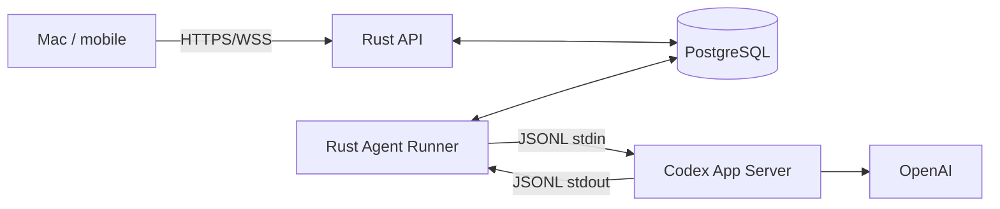

<!-- markdownlint-disable MD013 -->

# M4 서버 AI·Agent Runner 상세 명세

이 문서는 로컬 서버에서 ChatGPT 구독 인증을 사용하는 Codex App Server를 Rust Agent Runner 뒤에 붙이고, 대화·stream·승인을 Mac과 휴대폰에 안전하게 제공하는 구현 계약이다. 기간이나 인력 산출은 다루지 않는다. 공통 계약은 [공통 구현 계약](SHARED_CONTRACTS.md)을 우선한다.

## 1. 단계 결과

M4가 끝나면 다음 수직 흐름이 동작해야 한다.

```text
Mac 또는 휴대폰
→ 인증된 Jimin OS API에 turn 생성
→ PostgreSQL agent_jobs에 durable enqueue
→ Rust Agent Runner가 job claim
→ codex app-server에 thread/start 또는 thread/resume
→ turn/start
→ item/agentMessage/delta를 durable event로 변환
→ API WSS로 stream
→ command/file 요청이면 approval 저장 후 사용자 결정 대기
→ 결정 전달과 item/completed 확인
→ turn/completed와 최종 message 저장
```

Mac은 이 흐름의 필수 호스트가 아니다. 서버 AI가 unavailable이어도 일정·할 일·동기화 API는 계속 동작해야 한다.

## 2. 시작 조건

- M0에서 지원할 Codex CLI 기준 version과 `generate-json-schema` 산출물이 고정됐다.
- headless 서버의 `CODEX_HOME` volume에서 `codex login --device-auth`가 검증됐다.
- M1의 users, sessions, idempotency, WSS replay, migrations가 완료됐다.
- M3 client가 conversation/job/event/approval state를 cache하고 WSS replay할 수 있다.
- Agent container는 API와 별도 process/container로 배포된다.
- staging에서 OpenAI outbound, DNS, TLS, clock sync가 확인됐다.
- App Server protocol fixture에는 실제 credential, 개인 대화, 개인 파일이 없다.

## 3. 범위

### 포함

- Rust Agent Runner process
- `codex app-server --listen stdio://` child process 관리
- newline-delimited JSON message framing과 request correlation
- initialize/initialized handshake
- account availability, thread start/resume, turn start/interrupt
- item/turn notification adapter
- PostgreSQL durable job queue
- conversation/message read model
- stream chunk 저장과 WSS replay
- command/file approval 중계
- crash, provider, auth, rate limit, incompatibility 격리
- health, metrics, structured audit
- 실제 App Server staging integration test

### 제외

- App Server WebSocket transport
- OpenAI credential을 client에 전달하는 기능
- 모바일/브라우저에서 App Server 직접 연결
- 복수 AI provider routing
- 무승인 자율 작업
- public multi-tenant service
- 여러 Agent Runner의 active-active turn 분산
- M6 Mac Worker tool 실행
- experimental App Server API에 의존하는 기능
- reasoning 원문을 사용자에게 노출하거나 영구 저장하는 기능

## 4. 고정 아키텍처 경계



1. API는 App Server process handle을 갖지 않는다.
2. Agent Runner는 사용자 HTTP session을 검증하지 않는다. 검증된 API command를 DB에서 소비한다.
3. App Server stdout/stdin은 Runner와 같은 container namespace 안의 pipe로만 연결한다.
4. App Server wire type은 `crates/codex-client` 밖으로 노출하지 않는다.
5. PostgreSQL의 job, message, event, approval이 Jimin OS client의 원본이다.
6. Codex thread rollout과 auth cache는 전용 `CODEX_HOME` volume에 둔다.
7. WSS 전송 실패가 Agent loop를 block하지 않는다. Runner는 DB까지 기록하면 진행할 수 있다.
8. API readiness는 Agent readiness에 종속되지 않는다.

## 5. 코드 구성

```text
apps/agent
├─ main.rs                 # config, DB, supervisor, shutdown
├─ worker_loop.rs          # claim/lease/heartbeat
└─ health.rs

crates/codex-client
├─ generated/<version>/    # CLI가 생성한 version-specific schema/type
├─ wire.rs                 # request/response/notification envelope
├─ stdio_transport.rs      # child pipes, line framing, pending map
├─ process.rs              # spawn, signal, exit status
├─ compatibility.rs        # version/capability probe
└─ adapter.rs              # wire type → stable internal event

crates/agent-runtime
├─ jobs.rs                 # state transition, claim, recovery
├─ sessions.rs             # conversation ↔ Codex thread mapping
├─ turns.rs                # start, interrupt, terminal handling
├─ projector.rs            # App Server event → read model/event
├─ approvals.rs            # server request persistence/response
├─ stream_buffer.rs        # bounded delta coalescing
└─ errors.rs               # provider/runtime → application error

schemas/codex/<version>/
├─ json-schema/
├─ protocol-manifest.json
└─ checked-fixtures/
```

`protocol-manifest.json`에는 Codex CLI version, schema hash, generated command, 생성 시각, 지원 method, adapter version을 기록한다.

## 6. App Server process lifecycle

### 상태

```text
stopped
  → starting
  → handshaking
  → ready
  → degraded
  → backoff
  → starting

starting/handshaking → incompatible
starting/ready       → stopped (graceful shutdown)
```

- `ready`: handshake, account probe, 필수 method contract가 통과했다.
- `degraded`: 이미 시작한 turn을 정리하거나 일시 provider 오류를 관찰 중이다. 새 job claim을 중지한다.
- `backoff`: child crash/spawn 오류 뒤 jitter를 적용해 재시작한다.
- `incompatible`: version/schema/method가 지원 범위를 벗어났다. 자동 restart loop를 멈추고 AI만 unavailable로 둔다.

### spawn 계약

- command는 argv로 구성하고 shell string으로 실행하지 않는다.
- 기본 명령은 `codex app-server --listen stdio://`다.
- stdin/stdout은 pipe, stderr는 별도 bounded reader로 연다.
- child environment는 allowlist로 전달한다. 전체 API environment를 상속하지 않는다.
- `CODEX_HOME`, locale, certificate bundle, 필요한 proxy 값만 명시한다.
- process group을 만들고 graceful shutdown 뒤 남은 child를 종료한다.
- stdout의 JSONL 한 줄 크기와 pending request 개수에 상한을 둔다.
- malformed JSON, duplicate response ID, 알 수 없는 response ID는 protocol fault로 기록하되 원문 전체를 로그에 남기지 않는다.
- stderr drain이 막혀 child가 deadlock되지 않도록 항상 소비하고 크기를 제한한다.

### handshake

```text
1. codex --version 사전 확인
2. child spawn
3. initialize(clientInfo, stable capabilities) request
4. initialize response 검증
5. initialized notification
6. account/read `{ refreshToken: false }`
7. model/list 또는 schema에 정의된 필수 capability probe
8. ready 전환
```

connection당 `initialize`는 정확히 한 번만 보낸다. M4는 `experimentalApi`를 활성화하지 않는다. 필수 method는 `thread/start`, `thread/resume`, `turn/start`, `turn/interrupt`, stable item/turn notification, command/file approval request다.

### 호환성

- CLI에서 `codex app-server generate-json-schema --out ...`로 생성한 schema를 version별로 커밋한다.
- build는 generated schema hash와 manifest가 다르면 실패한다.
- startup은 실제 CLI version이 adapter 지원 범위 안인지 확인한다.
- unknown additive field와 unknown notification은 보존 가능한 raw metadata로 무시할 수 있어야 한다.
- 필수 field 누락, enum 의미 변경, 필수 method 부재는 `incompatible`다.
- deprecated event를 domain layer에서 직접 처리하지 않는다. version adapter가 current event로 정규화한다.
- model ID는 코드에 고정하지 않고 `model/list`와 운영 config로 선택한다.

## 7. stdio JSON-RPC 계약

App Server wire format은 JSON-RPC 2.0과 유사하지만 wire에서 `jsonrpc` header를 생략한다. stdio는 한 줄에 한 JSON message다.

### envelope

```rust
enum WireMessage {
    Request { id: RequestId, method: String, params: Value },
    Response { id: RequestId, result: Option<Value>, error: Option<WireError> },
    Notification { method: String, params: Value },
}
```

- Runner-origin pending response map과 App Server-origin request map을 분리한다. 양방향 ID가 전역에서 유일하다고 가정하지 않는다.
- pending map entry에는 method, job ID, deadline, response decoder를 저장한다.
- timeout으로 pending entry를 지워도 늦게 온 response는 process를 panic시키지 않는다.
- 모든 write는 하나의 serializer task를 통과해 line interleave를 막는다.
- 모든 read는 순서를 유지해 adapter와 projector에 전달한다.
- server-initiated request는 DB에 approval을 durable 저장하기 전 응답하지 않는다.
- process 종료 시 모든 pending request를 typed `runtime_disconnected`로 완료한다.

### stable internal event

```rust
enum CodexEvent {
    ThreadStarted { thread_id: String },
    TurnStarted { thread_id: String, turn_id: String },
    ItemStarted { item: AgentItem },
    MessageDelta { item_id: String, delta: String },
    ToolProgress { item_id: String, summary: ToolProgress },
    ApprovalRequested { request: ApprovalRequest },
    ServerRequestResolved { request_id: String },
    ItemCompleted { item: AgentItem },
    TurnCompleted { turn_id: String, outcome: TurnOutcome },
    TurnError { error: AgentProviderError },
}
```

`reasoning` raw content는 이 enum에서 client event로 변환하지 않는다. 사용자에게 필요한 것은 상태 요약과 tool progress이며 내부 chain-of-thought가 아니다.

## 8. database schema

공통 mutable field는 생략하지 않는다. 다음은 M4 고유 field다.

```text
conversations
- user_id
- title
- codex_thread_id nullable unique
- status: active | archived
- last_message_at

messages
- conversation_id
- agent_job_id nullable
- role: user | assistant | system_event
- content
- status: pending | streaming | completed | failed | cancelled
- client_message_id nullable
- provider_item_id nullable
- content_hash
- completed_at nullable

agent_jobs
- user_id
- conversation_id
- input_message_id
- state: queued | claimed | running | waiting_approval |
         retry_wait | completed | failed | cancelled | declined
- phase: preparing | starting_turn | streaming | tool_wait |
         completing | interrupting nullable
- priority
- idempotency_key unique
- claim_owner nullable
- claim_expires_at nullable
- attempt_count
- codex_thread_id nullable
- codex_turn_id nullable
- turn_start_sent_at nullable
- side_effect_boundary_crossed_at nullable
- cancel_requested_at nullable
- retry_after nullable
- error_code nullable
- error_detail_redacted nullable
- started_at nullable
- finished_at nullable

agent_events
- event_id bigint generated always as identity
- job_id
- conversation_id
- job_sequence bigint
- event_type
- entity_type
- entity_id
- payload jsonb
- payload_hash
- occurred_at
- unique(job_id, job_sequence)

approvals
- job_id
- conversation_id
- runner_instance_id
- provider_request_id
- provider_item_id
- kind: command | file_change | network
- status: pending | accepted | declined | expired | cancelled
- risk_summary
- preview jsonb
- available_decisions jsonb
- approved_payload_hash
- requested_at
- expires_at nullable
- decided_at nullable
- decided_by_device_id nullable
- provider_response_delivered_at nullable
- provider_resolved_at nullable
- unique(runner_instance_id, provider_request_id)
```

### 제약

- conversation 하나에는 terminal이 아닌 job이 하나만 존재하도록 partial unique index를 둔다.
- job claim은 `FOR UPDATE SKIP LOCKED`와 lease field를 사용한다.
- `job_sequence`는 job별 transaction에서 단조 증가한다.
- message final content는 `item/completed`를 authoritative source로 갱신한다.
- approval preview에는 command/file diff를 사용자에게 보여줄 최소 정보만 저장한다.
- raw provider error, prompt, command output은 일반 log에 복제하지 않는다.

## 9. API 계약

정확한 OpenAPI type은 코드에서 생성하며 모든 mutation은 인증, validation, request size, idempotency guard를 적용한다.

### 대화 생성

```http
POST /v1/conversations
Idempotency-Key: <uuidv7>

{
  "clientConversationId": "019...",
  "title": null
}
```

`201`로 Jimin OS conversation을 반환한다. 같은 `clientConversationId`와 같은
title을 재전송하면 기존 conversation을 반환한다. Codex thread는 첫 turn을 실행할
때 lazy create한다.

### turn 생성

```http
POST /v1/conversations/{conversationId}/turns
Idempotency-Key: <uuidv7>

{
  "clientMessageId": "019...",
  "input": [{ "type": "text", "text": "오늘 일정을 요약해줘" }]
}
```

서버 transaction은 user message와 `queued` job을 함께 만든다. `202` 응답은 `jobId`, `messageId`, `conversationId`, 현재 state를 반환한다. 같은 key/request는 같은 결과를 반환한다.

### job 조회·중지

```text
GET  /v1/agent/jobs/{jobId}
GET  /v1/conversations/{conversationId}/jobs/latest
POST /v1/agent/jobs/{jobId}/cancel
```

`jobs/latest`는 client 재시작이나 다른 기기에서 대화를 다시 열 때 가장 최근
job state를 복원하는 read model이다. 요청이 한 번도 없으면 `204`를 반환한다.

cancel은 멱등이다. `queued`는 바로 `cancelled`, active turn은 `cancelRequestedAt`을 기록한 뒤 Runner가 `turn/interrupt`를 보내고 확인된 terminal event에서 `cancelled`가 된다.

### event 복구

```text
GET /v1/conversations/{conversationId}/events?after={eventId}
```

eventId 오름차순 목록을 반환한다. WSS와 같은 envelope를 사용한다. client는 reconnect 뒤 replay하고 conversation/message/job read model을 재조회한다.

### 승인 결정

```http
POST /v1/approvals/{approvalId}/decision
Idempotency-Key: <uuidv7>

{
  "expectedVersion": 1,
  "decision": "accept"
}
```

M4 client에 노출하는 기본 선택은 `accept`, `decline`, `cancel`이다. session 전체 허용과 exec policy 수정은 별도 보안 검토 전까지 UI/API에서 허용하지 않는다. 첫 CAS 성공만 유효하고 중복 요청은 저장된 결과를 반환한다.

## 10. Agent job 상태 머신

공개 state는 공통 계약을 그대로 쓴다. 세부 진행은 `phase`와 event로 표현한다.

```text
queued
  → claimed
  → running
      ↔ waiting_approval
      → completed
      → failed
      → cancelled
      → declined
      → retry_wait → queued
```

### 전이 조건

- `queued → claimed`: lease 획득 transaction이 성공했다.
- `claimed → running`: App Server ready, thread 준비, `turn/start` 요청을 보낼 직전이다.
- `running → waiting_approval`: pending approval을 DB에 먼저 저장했다.
- `waiting_approval → running`: 사용자 decision을 provider에 전달했고 job에 다른 pending approval이 없다.
- `waiting_approval → declined`: 사용자가 거절했고 App Server가 관련 item/turn terminal을 확인했다.
- `running → completed`: `turn/completed` success와 final message projection이 같은 transaction 경계에서 완료됐다.
- `running → cancelled`: interrupt 뒤 terminal `interrupted`를 확인했다.
- `running → retry_wait`: 안전 재시도 경계 안의 일시 오류만 해당한다.
- `* → failed`: protocol, auth, incompatible, unsafe-to-replay, retry budget 소진이다.

### 안전 재시도 경계

- `turn_start_sent_at` 이전의 spawn/handshake/DB 오류는 lease 회수 뒤 재시도할 수 있다.
- Runner는 `turn/start`를 stdin에 쓰기 전에 `turn_start_sent_at`과 side-effect fence를 DB에 먼저 기록한다. 실제 write가 일어나지 않았어도 증명할 수 없으면 보수적으로 자동 재전송을 막는다.
- `turn/start`를 보낸 뒤에는 모델/tool side effect 여부를 완전히 증명할 수 없으므로 사용자 input을 자동 재전송하지 않는다.
- active turn 중 Runner/App Server가 죽으면 job은 `failed`와 `agent.recovery_required`가 되고 사용자가 `다시 보내기`로 새 job을 만든다.
- approval 대기 중 process가 죽으면 approval을 `cancelled`, job을 `failed`로 만들고 기존 decision을 새 process에 재사용하지 않는다.
- retry는 같은 job을 무한 재생하지 않으며 각 오류 category별 상한과 circuit breaker를 둔다.

v0.1에서 command/file approval의 `decline` 또는 `cancel`은 해당 도구만 건너뛰고 Agent가 계속 자율 진행하도록 두지 않는다. negative response를 전달하고 관련 item terminal을 확인한 뒤 active turn을 interrupt한다. turn terminal까지 확인한 후 job을 `declined`로 확정한다.

### concurrency

- 같은 conversation의 active turn은 하나만 허용한다.
- v0.1 운영 기본값은 Agent Runner당 active turn 하나다.
- concurrency는 config로만 늘리고 approval routing, memory, resource test가 통과하기 전 자동 확장하지 않는다.
- queue가 상한을 넘으면 API가 `429` 또는 typed busy error를 반환하고 기존 job을 버리지 않는다.

## 11. thread·turn lifecycle

### 첫 turn

```text
conversation.codex_thread_id 없음
→ thread/start
→ result.thread.id 저장
→ turn/start(threadId, input, policy)
→ result.turn.id 저장
```

thread ID 저장과 job 상태 갱신은 DB transaction으로 처리한다. `thread/start` 성공 뒤 DB 쓰기가 실패하면 같은 conversation에 thread를 중복 생성하지 않도록 recovery record와 provider ID를 남긴다.

### 이어서 대화

```text
conversation.codex_thread_id 있음
→ thread/resume(threadId)
→ thread ID 일치 확인
→ turn/start
```

resume이 thread not found로 실패하면 자동으로 새 thread를 만들지 않는다. conversation continuity가 끊기므로 `agent.thread_unavailable`로 실패시키고 운영 복구 또는 명시적 새 대화를 요구한다.

### 기본 execution policy

- stable internal `ExecutionProfile::ServerPersonalAssistant`를 정의한다.
- version adapter가 profile을 해당 schema의 approval/sandbox field로 매핑한다.
- 기본 workspace는 Agent 전용 빈 workspace다.
- read-only를 기본으로 하고 M4 approval 수직 테스트용 isolated test workspace만 write capability를 연다.
- network는 모델 통신과 명시적으로 허용한 provider 외 tool에 열지 않는다.
- generated schema에 존재하는 가장 엄격한 수동 승인 정책을 사용한다.
- wire enum 문자열을 domain/config에 직접 퍼뜨리지 않는다.

## 12. stream·read model projection

### event mapping

| App Server | Jimin OS event | durable 처리 |
| --- | --- | --- |
| `turn/started` | `agent.turn.started` | job turn ID/state 갱신 |
| `item/started` agent message | `agent.message.started` | assistant message `streaming` 생성 |
| `item/agentMessage/delta` | `agent.message.delta` | bounded chunk append |
| command/file progress | `agent.tool.progress` | sanitized summary 저장 |
| approval request | `agent.approval.required` | approval insert 후 publish |
| `serverRequest/resolved` | `agent.approval.resolved` | provider resolved 시각 갱신 |
| `item/completed` | `agent.item.completed` | item final state authoritative 반영 |
| `error` | `agent.turn.error` | typed error 저장 |
| `turn/completed` | `agent.turn.completed` 또는 `failed` | job/message terminal 처리 |

### delta buffer

- token마다 WSS/DB row를 만들지 않고 순서를 보존하는 bounded buffer로 합친다.
- chunk는 크기 상한, 짧은 flush interval, item terminal 중 먼저 만족한 조건에서 저장한다.
- buffer가 가득 차면 Agent loop를 무한 block하지 않고 강제 flush한다.
- `item/completed`의 final content를 authoritative 값으로 저장하고 delta 조립 결과와 다르면 final 값으로 교체한다.
- client가 duplicate event를 받아도 `eventId`로 한 번만 append한다.
- WSS slow consumer는 연결만 끊고 DB event와 Agent turn은 계속 진행한다.

### reasoning과 tool output

- raw reasoning/textDelta는 client에 전달하거나 저장하지 않는다.
- plan 또는 reasoning summary가 꼭 필요하면 별도 사용자용 summary type만 허용한다.
- command output은 기본적으로 progress 요약과 exit status만 저장한다.
- 전체 output이 필요한 기능은 M6의 암호화/retention/권한 계약을 따른다.

## 13. 승인 상태·전달 계약

### 생성

1. server-initiated request의 method와 params를 version adapter가 검증한다.
2. command/file과 command의 network context를 stable `ApprovalRequest`로 변환한다.
3. 표시용 preview와 실제 provider response 대상 payload의 hash를 계산한다.
4. `pending` approval과 `agent.approval.required` event를 같은 DB transaction에 저장한다.
5. 그 뒤 client에 publish하고 provider request는 응답 없이 대기한다.

### 결정

1. API가 user, device, job, approval state, expiry, `expectedVersion`을 검증한다.
2. `pending`에서 terminal decision으로 CAS한다.
3. decision outbox를 생성한다.
4. Runner가 같은 `runner_instance_id + provider_request_id`가 아직 pending인지 확인한다.
5. approved payload hash가 요청 시 hash와 같은지 확인한다.
6. App Server stdin에 response를 쓴 뒤 `provider_response_delivered_at`을 기록한다.
7. `serverRequest/resolved` 또는 terminal item에서 `provider_resolved_at`을 기록한다.

approval `status`가 accepted여도 `provider_response_delivered_at`이 없으면 실행 성공을 뜻하지 않는다. UI는 decision과 job 실행 결과를 분리해 표시한다.

`availableDecisions`가 있으면 API 선택지는 그 교집합만 허용한다. `tool/requestUserInput`, permission subset 같은 다른 response shape의 server request는 M4 범위 밖이다. version adapter가 schema에 맞는 안전한 거절/cancel response를 보내고 job을 `agent.unsupported_interaction`으로 종료하며, 응답 형태를 추측해 accept하지 않는다.

### race·만료

- 두 기기가 동시에 결정하면 첫 CAS만 성공한다. 다른 기기는 현재 terminal state를 받는다.
- App Server가 요청을 먼저 정리하면 `pending → cancelled`로 CAS하고 늦은 user decision은 `409`다.
- expiry는 사용자 결정 가능 시한이며 expiry 후 자동 accept하지 않는다.
- decision 전달 중 process가 죽으면 approval을 재응답하지 않고 job을 recovery-required failure로 종료한다.
- 수정된 command/diff는 기존 approval을 재사용하지 않고 새 approval ID와 hash를 만든다.

### 사용자 표시

command approval에는 목적, 실행 위치, argv/요약, 변경 가능성, network target을 분리해 보여준다. file approval에는 파일 목록과 diff preview를 보여준다. 일반 UI에 provider request ID나 JSON을 노출하지 않는다.

기본 문구:

- 제목: `이 작업을 실행할까요?`
- 설명: `실행할 내용과 영향을 확인한 뒤 허용해 주세요.`
- action: `이번만 허용하기`, `거절하기`
- 이미 처리됨: `다른 기기에서 이미 처리했어요.`
- 만료됨: `요청 시간이 지나 실행하지 않았어요. 필요하면 다시 요청해 주세요.`

## 14. 취소 계약

- queued/claimed job은 provider turn이 시작되지 않았다면 DB CAS로 취소한다.
- running job은 API가 `cancel_requested_at`을 기록하고 Runner가 `turn/interrupt`를 보낸다.
- client는 요청 직후 `중지하는 중`을 표시하고 terminal event 전까지 완료로 단정하지 않는다.
- App Server가 `turn/completed` interrupted를 보내면 job/message를 `cancelled`로 확정한다.
- interrupt response 없이 process가 죽으면 `failed`와 recovery-required로 처리한다. side effect가 없었다고 추정해 `cancelled`로 바꾸지 않는다.
- cancel endpoint 재시도는 같은 결과를 반환한다.

## 15. 오류 분류와 UX

| provider/runtime | application code | 사용자 문구 | retry |
| --- | --- | --- | --- |
| auth 없음/만료 | `agent.auth_required` | AI에 다시 로그인해 주세요. | 로그인 후 |
| usage limit | `agent.usage_limit` | 지금은 AI 사용 한도에 도달했어요. 한도가 갱신된 뒤 다시 시도해 주세요. | reset 후 |
| context exceeded | `agent.context_too_large` | 이 대화가 너무 길어 계속할 수 없어요. 새 대화에서 다시 시작해 주세요. | 새 conversation |
| upstream connection | `agent.provider_unavailable` | AI에 연결할 수 없어요. 잠시 후 다시 시도해 주세요. | 수동/안전 자동 |
| stream disconnected | `agent.stream_interrupted` | 응답 연결이 끊겼어요. 저장된 내용까지 보여드려요. | 새 job |
| sandbox denied | `agent.action_not_allowed` | 이 작업은 현재 권한으로 실행할 수 없어요. | policy 변경 후 |
| bad request | `agent.request_invalid` | 요청을 처리할 수 없어요. 내용을 바꿔 다시 시도해 주세요. | 수정 후 |
| protocol mismatch | `agent.incompatible` | AI 기능을 업데이트해야 해요. 일정과 할 일은 계속 사용할 수 있어요. | 배포 조치 |
| child crash | `agent.runtime_unavailable` | AI 작업이 중단됐어요. 다시 보내기 전에 실행 결과를 확인해 주세요. | 명시적 재전송 |

오류 화면은 `다시 시도`, `새 대화 시작하기`, `저장된 응답 보기`처럼 실제 복구 행동을 제공한다. 내부 stack, HTTP body, `codexErrorInfo`, command 원문을 그대로 보여주지 않는다.

## 16. 장애 격리와 복구

### process/container

- API와 Agent를 별도 container로 실행한다.
- Agent container restart policy는 crash loop를 숨기지 않도록 circuit breaker/health와 함께 사용한다.
- API `/health/ready`는 Agent down 때문에 실패하지 않는다.
- 별도 dependency status에 `available | degraded | unavailable | incompatible | authRequired`를 제공한다.
- App Server child crash는 Agent process supervisor가 처리하고 API process에는 signal을 보내지 않는다.

### DB lease recovery

- Runner instance는 unique ID와 heartbeat를 가진다.
- stale `claimed` 또는 `running` job은 `turn_start_sent_at`이 없을 때만 `retry_wait`를 거쳐 queue로 되돌릴 수 있다.
- `turn_start_sent_at`이 있는 stale `running`과 모든 stale `waiting_approval` job은 자동 replay하지 않고 `failed`로 종료한다.
- terminal job과 message projection은 idempotent transaction으로 다시 실행 가능해야 한다.
- orphan pending approval은 `cancelled`로 바꾸고 provider request가 남아 있다고 가정하지 않는다.

### provider·network

- provider unavailable은 새 claim을 일시 중지하되 기존 일정 API를 제한하지 않는다.
- authRequired/incompatible는 자동 retry하지 않는다.
- rate limit reset 시각이 있으면 상태 API에 안전한 값만 전달한다.
- retry storm을 막기 위해 error category별 backoff, jitter, circuit breaker를 둔다.

### disk·backpressure

- DB event 저장 실패 시 stream을 client에만 보내고 계속하지 않는다. durable 저장이 복구될 때까지 turn을 중지하거나 실패시킨다.
- Agent event queue, stderr, delta buffer, WSS subscriber queue는 모두 bounded다.
- disk/volume 임계치에 도달하면 새 job claim을 중지하고 readiness/dependency 상태를 내린다.
- `CODEX_HOME` 손상은 새 thread로 조용히 대체하지 않고 운영 복구를 요구한다.

## 17. 보안 계약

- Agent/App Server container는 non-root, read-only root filesystem으로 실행한다.
- Docker socket, host root, API secret directory, PostgreSQL backup을 mount하지 않는다.
- `CODEX_HOME`은 Agent 전용 volume이며 filesystem permission을 최소화한다.
- ChatGPT auth cache를 image, Git, 일반 DB, log, support bundle에 포함하지 않는다.
- App Server는 stdio transport만 사용하고 listener port를 열지 않는다.
- Agent workspace와 temp만 write 가능하게 mount한다.
- server personal assistant profile의 tool/network/path capability는 allowlist로 제한한다.
- prompt, model output, tool output은 외부 입력으로 취급한다.
- approval preview hash와 실제 실행 payload hash가 다르면 실행을 거절한다.
- user/device authorization은 API와 application service 양쪽에서 검증한다.
- command를 audit할 때 원문 전체 대신 hash, 분류, 결과, 승인자, timestamp를 기본으로 남긴다.
- tracing span에 request/job/thread/turn/item ID는 넣되 대화 원문과 token은 넣지 않는다.
- core dump와 crash report에서 environment/credential이 노출되지 않게 설정한다.

## 18. 관찰성

### metrics

- job count by state/error category
- queue depth와 oldest queued age
- claim/turn/first-delta/completion latency
- active turn과 pending approval count
- App Server restart/crash/handshake failure count
- JSON-RPC pending map size와 timeout count
- delta buffer/DB/WSS queue saturation count
- provider status category와 rate-limit 상태
- event replay gap과 duplicate count

### structured event

- Agent process state change
- schema/version compatibility result
- job state transition
- thread/turn/item correlation
- approval requested/decided/delivered/resolved
- circuit breaker open/close
- recovery-required 판정 이유

민감 payload는 metric label이나 structured log field로 사용하지 않는다.

## 19. 테스트 전략

### unit

- JSONL partial read, multiple line, oversized line, invalid UTF-8/JSON
- request ID correlation, out-of-order response, late response, duplicate ID
- unknown additive notification 무시
- App Server wire type → stable event mapping
- job/approval state transition과 terminal immutability
- safe retry boundary 판정
- delta coalescing 순서와 final item authoritative 교체
- provider error → application error/UX mapping
- approval payload hash와 CAS race

### fake App Server contract

test binary가 다음 trace를 deterministic하게 재생한다.

1. initialize success/failure/repeat
2. thread start/resume와 turn success
3. delta 여러 개 뒤 final item 차이
4. command approval accept/decline/cancel
5. file approval과 diff 변경
6. `serverRequest/resolved`가 decision보다 먼저 도착
7. error 뒤 turn failed
8. stdout malformed line/close
9. stderr flood
10. response timeout과 late response

trace와 generated schema가 어긋나면 contract test를 실패시킨다.

### PostgreSQL integration

- migration from empty DB
- idempotent turn enqueue
- `SKIP LOCKED` single claim
- stale claim recovery
- conversation active job partial unique index
- job_sequence 경쟁
- message/event terminal projection transaction rollback
- approval two-device CAS
- decision outbox delivery retry와 orphan 처리

### 실제 App Server staging

- pinned/supported CLI version handshake
- account/read와 model/list
- thread/start → turn/start → delta → item/turn completed
- process restart 후 thread/resume
- usage limit/auth unavailable 상태
- command/file approval round trip in isolated fixture workspace
- interrupt와 terminal interrupted
- container restart 후 `CODEX_HOME` 유지

실제 인증이 필요한 test는 staging 전용 manual/secure job으로 분리하고 CI fixture에 credential을 넣지 않는다.

### fault injection

- spawn 직후, handshake 중, turn/start 전후, delta 중, approval 대기 중 child kill
- Agent container kill과 restart
- DB connection loss/transaction failure
- OpenAI DNS/TLS/stream disconnect
- WSS slow consumer와 reconnect
- disk full/volume read-only
- incompatible CLI version
- duplicate approval from Mac과 휴대폰
- cancel과 turn completion race

### E2E

1. Mac과 휴대폰에서 server AI 새 대화를 시작한다.
2. 휴대폰 background/foreground 뒤 누락 delta를 replay한다.
3. 두 기기에서 같은 approval을 눌러 한 결정만 적용되는지 확인한다.
4. Agent를 죽여도 일정/할 일 CRUD가 계속되는지 확인한다.
5. App Server restart 뒤 기존 completed conversation을 열고 다음 turn을 resume한다.
6. active turn crash가 자동 재실행되지 않고 `다시 보내기`를 요구하는지 확인한다.
7. 서버 AI는 Mac이 꺼져 있어도 동작하고 Mac Worker 기능만 unavailable인지 확인한다.

## 20. 구현 순서

1. 지원 CLI version, generated schema, protocol manifest, adapter trait를 고정한다.
2. fake App Server와 stdio transport/parser/correlation test를 먼저 만든다.
3. child supervisor, handshake, compatibility, dependency health를 구현한다.
4. conversation/message/job/event/approval migration과 repository를 구현한다.
5. idempotent turn API와 PostgreSQL claim loop를 연결한다.
6. thread start/resume, turn start/interrupt runtime을 구현한다.
7. item/delta/terminal projector와 WSS replay를 구현한다.
8. approval persistence, CAS, decision outbox, provider response를 구현한다.
9. crash recovery와 safe retry boundary를 fault injection으로 검증한다.
10. auth/rate-limit/provider/protocol 오류를 typed status와 UX로 연결한다.
11. container security, volume, log masking, metrics를 검증한다.
12. 실제 staging App Server와 Mac/휴대폰 E2E를 통과한다.

## 21. 완료 게이트

- [ ] `codex app-server`는 stdio child process로만 실행되고 외부 port가 없다.
- [ ] initialize/initialized, account probe, thread start/resume, turn start/interrupt가 typed adapter로 동작한다.
- [ ] App Server generated schema와 adapter version이 build/startup에서 검증된다.
- [ ] user message와 queued job이 같은 DB transaction에서 생성된다.
- [ ] client reconnect 뒤 event replay로 stream이 중복 없이 복구된다.
- [ ] final message는 `item/completed`와 `turn/completed`를 기준으로 확정된다.
- [ ] approval은 DB 저장 전에 provider에 응답하지 않는다.
- [ ] 두 기기의 approval race에서 첫 CAS만 적용된다.
- [ ] 승인 payload hash와 실제 실행 payload hash가 일치하지 않으면 실행되지 않는다.
- [ ] active turn crash가 자동 재전송되지 않고 recovery-required가 된다.
- [ ] Agent/App Server 장애 중 일정·할 일 API와 API readiness가 정상이다.
- [ ] auth, usage limit, provider, protocol, sandbox 오류가 서로 다른 사용자 복구 행동으로 표시된다.
- [ ] credential, 대화 원문, reasoning, command output이 일반 log에 남지 않는다.
- [ ] fake protocol, PostgreSQL integration, fault injection, 실제 staging E2E가 통과한다.
- [ ] non-root, read-only rootfs, volume/network/mount 보안 검사가 통과한다.
- [ ] OpenDock backend/UX writing 해당 gate가 통과한다.

## 22. 공식 구현 참고

- [OpenAI Codex App Server](https://developers.openai.com/codex/app-server/)
- [OpenAI Codex authentication](https://developers.openai.com/codex/auth/)

공식 App Server 문서 기준으로 stdio는 기본 JSONL transport이며, connection당 `initialize` 후 `initialized`가 필요하다. schema는 실행한 Codex version별로 CLI에서 생성한다. command/file approval은 App Server가 client에 보내는 server-initiated request이며 최종 item state는 `item/completed`, turn 종결은 `turn/completed`에서 확인한다. 구현 시 이 요약보다 고정한 version의 generated schema를 우선한다.
