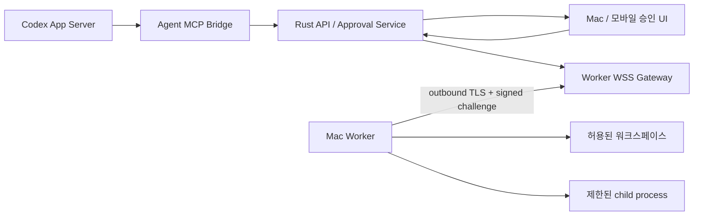

# M6. Mac Worker와 로컬 작업 명세

이 문서는 [공통 구현 계약](SHARED_CONTRACTS.md)과 [M4 서버 AI 명세](M4_SERVER_AGENT.md)의 작업·승인 상태 계약을 따른다. 이 문서의 Worker operation 상태는 M4의 `approvals.status`를 대체하지 않는다.

## 1. 목적

M6의 목적은 로컬 서버의 Agent가 사용자의 명시적인 승인 아래 Mac의 허용된 워크스페이스를 읽고, 제한된 파일 변경과 명령을 실행할 수 있게 하는 것이다.

Mac Worker는 Jimin OS의 필수 본체가 아니다. 서버에 outbound 연결하는 선택적 실행 노드이며, Mac이 꺼져 있어도 일정·할 일·기억·서버 AI 기능은 계속 동작해야 한다.

이 단계에서 검증할 수직 흐름은 다음과 같다.

```text
Agent가 Mac 파일 정보 필요
→ 허용된 워크스페이스에서 검색·읽기 요청
→ 수정 patch 제안
→ 사용자가 정확한 변경 내용을 승인
→ Mac Worker가 동일한 patch인지 다시 검증하고 적용
→ 제한된 검증 명령 승인·실행
→ 결과와 감사 기록을 서버에 반환
```

## 2. 선행 조건

- M1의 기기 세션, 감사 로그, idempotency 처리, WSS 기반 이벤트가 동작한다.
- M4의 Agent job, tool approval, Agent Runner가 동작한다.
- M5의 프로젝트·기억 context를 Agent가 조회할 수 있다.
- Mac 앱이 macOS Keychain과 Tauri IPC를 사용할 수 있다.
- 서버와 Mac 사이 통신은 TLS가 적용된 사설 네트워크 경로를 사용한다.

## 3. 범위

### 3.1 포함

- Mac Worker 등록·pairing·폐기
- outbound authenticated WSS 연결
- worker heartbeat와 상태 표시
- 한 개 이상 워크스페이스 allowlist 등록 구조
- v0.1 수직 검증용 활성 워크스페이스 한 개
- capability 광고·승인·제약 교집합 계산
- MCP bridge와 worker operation 전달
- 제한된 파일 목록·검색·읽기
- unified diff 제안, 승인, 적용
- 사전 등록한 command profile 실행
- 승인 상태 머신과 tamper 방지
- 재연결, 중복 전달, 결과 불확실성 처리
- 보안 감사 로그와 즉시 revoke

### 3.2 제외

- Mac inbound port 개방
- root 또는 `sudo` 실행
- 임의 shell 문자열 실행
- 사용자가 허용하지 않은 디렉터리 접근
- 파일 삭제·이름 변경·binary patch·symlink 수정
- GUI 자동화와 브라우저 조작
- 여러 Mac에 같은 작업을 자동 분산
- 장시간 무인 자동 실행과 상시 승인
- 완전한 macOS sandbox 또는 VM 격리
- Mac의 credential·Keychain 내용을 Agent에 제공

## 4. 구성요소와 신뢰 경계



신뢰 규칙:

- Codex와 MCP tool argument는 신뢰하지 않는다.
- 서버에 저장된 capability만으로 실행을 허용하지 않는다. Worker의 현재 allowlist와 다시 교집합을 구한다.
- 사용자의 승인은 정확한 canonical action hash에 결합한다.
- Worker는 서버의 `accepted` 승인 상태도 그대로 신뢰하지 않고 서명, expiry, action hash를 검증한다.
- 파일 경로는 문자열 prefix가 아니라 canonical path와 file descriptor 기준으로 검사한다.
- Worker 프로세스는 로그인한 사용자 권한을 넘지 않는다.

## 5. Worker identity와 pairing

### 5.1 장기 identity

- 최초 실행 시 Worker가 Ed25519 key pair를 생성한다.
- private key는 macOS Keychain에 `service=jimin-os.mac-worker`, `account=<local-worker-id>`로 저장한다.
- 서버에는 public key와 key fingerprint만 저장한다.
- private key, Keychain export, ChatGPT·Google credential은 서버로 전송하지 않는다.
- 앱 삭제·Keychain 초기화로 key가 사라지면 기존 node를 재사용하지 않고 다시 pairing한다.

### 5.2 Pairing 흐름

1. 로그인한 사용자가 Mac 또는 휴대폰 앱에서 `Mac 연결`을 요청한다.
2. 서버가 32-byte random secret을 만들고 hash만 `worker_pairing_sessions`에 저장한다.
3. 앱은 secret이 포함된 일회용 QR payload 또는 Base32 20자 코드를 표시한다.
4. Mac 앱이 local IPC로 secret을 Worker에 넘긴다. CLI 실행 시에는 코드를 직접 입력할 수 있다.
5. Worker가 key pair, display name, macOS version, Worker version, random nonce와 함께 claim한다.
6. 서버가 secret hash, 만료, 사용 여부, 시도 횟수, allowlisted user를 검증한다.
7. 서버가 `worker_node`를 만들고 pairing session을 같은 transaction에서 소비한다.
8. Worker가 server challenge에 서명해 key possession을 증명한다.
9. 앱에 public key fingerprint와 Mac 이름을 보여 주고 사용자가 최종 확인한다.
10. 확인 후 node가 `offline`이 되고 인증된 WSS 연결이 가능해진다.

Pairing 정책:

- session 기본 만료는 10분이다.
- secret 원문은 로그, metric, audit detail에 남기지 않는다.
- 한 session은 한 번만 claim할 수 있다.
- claim 실패 5회 후 session을 폐기한다.
- 수동 코드는 대소문자와 혼동 문자를 정규화하되 entropy를 줄이는 짧은 숫자 코드는 사용하지 않는다.
- final confirmation 전에는 capability와 작업을 받을 수 없다.
- 첫 인증 WSS 연결 후 node는 `online`이 된다.

### 5.3 연결 인증

Worker는 장기 bearer token을 사용하지 않는다.

1. `POST /v1/worker-auth/challenge`에 `node_id`를 보낸다.
2. 서버가 32-byte nonce와 짧은 expiry를 발급한다.
3. Worker가 `node_id + nonce + client_timestamp + protocol_version`의 canonical bytes를 서명한다.
4. `POST /v1/worker-auth/exchange`가 서명을 검증하고 짧은 WSS session token과 memory-only session MAC key를 발급한다.
5. `GET /v1/workers/connect` upgrade 시 token을 `Authorization` header로 전달하고 이후 message에도 sequence와 HMAC signature를 적용한다.

session token을 URL query, log, SQLite에 넣지 않는다. session MAC key는 TLS 안에서 한 번 전달하고 연결 종료 시 폐기한다. challenge는 한 번만 사용할 수 있다. revoke된 node, 지원하지 않는 protocol, 비정상 clock skew는 연결을 거절한다. challenge·exchange endpoint에는 node와 source 기준 rate limit을 적용하고 node 존재 여부를 구분하는 오류를 외부에 반환하지 않는다.

## 6. 데이터 모델

### 6.1 `worker_nodes`

| 컬럼 | 설명 |
|---|---|
| `id` | UUIDv7 PK |
| `user_id` | 소유 사용자 |
| `display_name` | 사용자에게 보이는 Mac 이름, 최대 80자 |
| `public_key` | Ed25519 public key |
| `key_fingerprint` | 사용자 확인용 fingerprint, unique |
| `status` | `pending_confirmation`, `offline`, `online`, `degraded`, `revoked`, `upgrade_required` |
| `worker_version` | 마지막 연결 version |
| `protocol_version` | 협상된 protocol version |
| `os_version` | 민감하지 않은 진단 정보 |
| `last_seen_at` | 마지막 유효 heartbeat |
| `revoked_at` | 폐기 시각 |
| `revoked_reason` | 폐기 이유 |
| `created_at`, `updated_at` | 시각 |

### 6.2 `worker_pairing_sessions`

- `id`, `user_id`, `secret_hash`, `expires_at`
- `failed_attempts`, `claimed_at`, `claimed_node_id`
- `created_by_device_id`, `created_at`, `updated_at`, `version`

소비·만료된 session은 재활성화하지 않는다.

### 6.3 `worker_workspaces`

| 컬럼 | 설명 |
|---|---|
| `id` | 서버에서 사용하는 workspace ID |
| `worker_node_id` | 소유 node |
| `alias` | UI와 Agent에 노출할 별칭 |
| `root_fingerprint` | canonical root path의 salted hash |
| `display_path` | `~/Projects/jimin-os`처럼 축약한 표시용 경로 |
| `permissions` | read, search, patch 요청 가능 여부 |
| `blocked_patterns` | 기본 차단에 추가할 glob |
| `enabled` | 비활성화 가능 |
| `version` | 변경 동시성 제어 |

서버에는 전체 절대 경로를 저장하지 않는다. 실제 canonical root는 Worker의 로컬 encrypted config에 저장한다.

### 6.4 `worker_capabilities`

- `id`, `worker_node_id`, `capability_name`, `capability_version`
- `advertised_constraints`: Worker가 지원하는 최대 범위
- `granted_constraints`: 사용자가 허용한 범위
- `effective_constraints`: 서버가 계산하고 hash한 교집합
- `granted_at`, `revoked_at`, `created_at`, `updated_at`, `version`
- unique `(worker_node_id, capability_name)`

허용 capability:

- `workspace.list`
- `workspace.search`
- `workspace.read`
- `workspace.propose_patch`
- `command.run_profile`

### 6.5 `worker_operations`

| 컬럼 | 설명 |
|---|---|
| `id` | 전 구간 correlation에 사용하는 UUIDv7 |
| `user_id`, `worker_node_id` | 경계 |
| `agent_job_id`, `approval_id` | 호출 원인 |
| `operation_type` | `list`, `search`, `read`, `patch`, `command` |
| `canonical_payload` | 검증된 구조화 요청 |
| `action_hash` | canonical payload SHA-256 |
| `state` | 상태 머신 값 |
| `attempt` | 전달 attempt; 실행 재시도 횟수와 구분 |
| `result_summary` | 크기 제한된 결과 metadata |
| `result_hash` | 결과 hash |
| `error_code` | 안정적인 내부 code |
| `created_at`, `accepted_at`, `started_at`, `finished_at` | 시각 |
| `updated_at`, `version` | 상태 변경 시각과 optimistic concurrency |

작업 원문 output과 patch는 별도 encrypted/blob 저장소를 사용하고 보존 정책이 끝나면 제거한다. audit log에는 hash와 요약만 남긴다.

### 6.6 M4 `approvals` 확장

M6는 M4의 approval CAS·API·event를 재사용한다. Migration은 `approvals`에 다음 field와 제약을 추가한다.

```text
origin: codex_runtime | mac_worker
worker_operation_id nullable unique
```

- `origin = codex_runtime`이면 M4의 `runner_instance_id + provider_request_id`가 존재해야 한다.
- `origin = mac_worker`이면 `worker_operation_id`가 존재해야 하며 provider field는 null일 수 있다.
- Worker patch는 `kind=file_change`, command는 `kind=command`, turn 범위 read는 `kind=permission`을 사용한다.
- `approved_payload_hash`에는 이 문서의 `action_hash`를 저장한다.
- `worker_operation`과 `pending` approval, `agent.approval.required` outbox는 한 DB transaction에서 만든다.
- 결정 API와 terminal 상태는 M4의 `pending → accepted|declined|expired|cancelled`를 그대로 따른다.

## 7. Worker 연결 protocol

### 7.1 Envelope

```json
{
  "protocolVersion": "1",
  "messageId": "uuid",
  "sequence": 42,
  "type": "operation.requested",
  "sentAt": "2026-07-10T00:00:00Z",
  "payload": {},
  "signature": "base64"
}
```

- canonical bytes는 RFC 8785 JSON Canonicalization Scheme을 사용하고 `signature` field를 제외해 계산한다.
- 각 방향 sequence는 연결마다 1부터 단조 증가한다.
- `signature`는 handshake에서 받은 session MAC key로 canonical envelope에 계산한 HMAC-SHA-256이다.
- 중복 `messageId`는 결과를 다시 반환하되 작업을 다시 실행하지 않는다.
- 빠진 sequence가 있으면 연결을 재동기화한다.
- payload 크기는 기본 256 KiB 이하로 제한한다. 큰 output·patch는 인증된 별도 upload/download endpoint를 사용한다.
- protocol version은 handshake에서 협상하며 지원 범위 밖이면 `upgrade_required`로 전환한다.

### 7.2 Heartbeat와 상태

- Worker는 20초 간격으로 heartbeat를 보낸다.
- 3회 연속 heartbeat를 받지 못하면 서버는 `offline`으로 표시한다.
- capability 등록 실패나 일부 로컬 검사 실패는 `degraded`다.
- `offline` 판정이 일정·할 일·기억·서버 AI readiness를 실패시키면 안 된다.
- Worker가 sleep에서 돌아오면 새 challenge/session으로 재연결한다.

## 8. 워크스페이스 등록과 경로 안전성

### 8.1 등록

- 사용자가 macOS native directory picker로 root를 선택한다.
- Worker가 `realpath`, directory 여부, 접근 권한을 확인한다.
- root가 `/`, home 전체, `/Users`, system directory이면 거절한다.
- v0.1에서는 사용자가 활성 워크스페이스 한 개를 선택해 수직 흐름을 검증한다.
- workspace 변경 시 기존 pending operation을 취소하고 capability version을 증가시킨다.

### 8.2 기본 차단 경로

다음은 workspace 안에 있더라도 기본 차단한다.

```text
.git/**
.env
.env.*
**/*.pem
**/*.key
**/id_rsa*
**/.ssh/**
**/Library/Keychains/**
**/node_modules/**
**/target/**
```

`.gitignore`는 읽을 수 있지만 `.git` 내부 object와 config는 읽지 않는다. 사용자는 추가 blocked glob을 설정할 수 있지만 기본 차단을 해제할 수 없다.

### 8.3 경로 검증

모든 file operation은 다음 검사를 Worker에서 실행 직전에 다시 수행한다.

1. 입력은 UTF-8 상대 경로만 허용하고 절대 경로, NUL, 빈 segment를 거절한다.
2. `..` segment를 정규화하기 전에 거절한다.
3. workspace root와 target을 canonicalize한다.
4. target이 canonical root의 descendant인지 path component 단위로 확인한다.
5. 중간 경로 또는 target이 symlink면 v0.1에서는 거절한다.
6. open 이후 file metadata를 재확인해 check-use 사이 교체를 탐지한다.
7. blocked pattern과 파일 종류·크기 제한을 확인한다.

문자열 `starts_with`만으로 경로 경계를 검사하지 않는다.

## 9. MCP bridge 명세

Codex App Server에는 Agent Runner 내부 MCP server가 다음 도구를 제공한다.

MCP call이 승인을 요구하면 bridge는 request를 열린 상태로 유지하고 Agent job을 `waiting_approval`로 전환한다. `accepted`이면 Worker 결과가 올 때까지 bounded progress만 보내고 최종 tool result를 반환한다. `declined`, `expired`, `cancelled`이면 구조화된 tool error로 종료한다. App Server 또는 bridge process가 끊기면 기존 approval을 새 process에서 재사용하지 않는다.

### 9.1 `mac.list_workspaces`

- 입력: 없음
- 출력: online node, workspace ID·alias, 가능한 capability
- 실제 절대 경로는 반환하지 않는다.
- pairing에서 허용된 metadata 조회이므로 추가 실행 승인은 요구하지 않는다.

### 9.2 `mac.search_files`

입력:

```json
{
  "workspaceId": "uuid",
  "query": "MemoryRepository",
  "includeGlobs": ["**/*.rs"],
  "maxResults": 100
}
```

규칙:

- query 1~200자, glob 최대 10개, 결과 최대 200개다.
- shell을 사용하지 않고 Worker가 고정된 `rg` argv 또는 Rust 검색 구현을 호출한다.
- `.gitignore`와 blocked pattern을 적용한다.
- 결과는 상대 경로, line, 500자 이하 excerpt만 포함한다.
- 한 Agent turn에서 처음 읽기 작업 시 승인받은 workspace read scope 안에서만 수행한다.

### 9.3 `mac.read_file`

입력은 workspace ID, 상대 경로, 선택적 line range다.

- text file만 허용한다.
- 파일 하나 최대 1 MiB, 한 operation 전체 5 MiB다.
- line range가 없으면 크기 제한 안에서 전체를 반환한다.
- UTF-8이 아니면 binary로 취급해 거절한다.
- 결과에 SHA-256 `baseHash`를 포함한다.
- server와 Agent log에는 본문을 남기지 않는다.

### 9.4 `mac.propose_patch`

입력은 workspace ID, unified diff, 각 대상 파일의 `baseHash`, 변경 설명이다.

이 도구는 즉시 파일을 쓰지 않는다.

1. Worker가 patch를 parse·preflight한다.
2. 변경 파일, line 수, before/after hash, diff preview를 서버에 반환한다.
3. 서버가 immutable `worker_operation`과 approval을 만든다.
4. 사용자가 정확한 diff와 risk를 보고 승인한다.
5. 승인된 action hash와 현재 operation payload가 같을 때만 Worker에 apply 요청을 보낸다.
6. Worker가 base hash와 path를 다시 검사한 뒤 atomic apply한다.
7. 결과 hash와 변경 요약을 반환한다.

Agent에 별도 unrestricted `apply_patch` 도구를 노출하지 않는다.

### 9.5 `mac.run_command`

입력:

```json
{
  "workspaceId": "uuid",
  "profileId": "cargo-test-workspace",
  "arguments": ["--all-targets"],
  "reason": "변경 후 테스트를 실행합니다"
}
```

- `program` 문자열을 Agent가 직접 보내지 않는다.
- server와 Worker에 같은 version의 command profile이 있어야 한다.
- profile에 허용된 추가 argument만 받을 수 있다.
- 모든 command는 별도 사용자 승인이 필요하다.
- stdout/stderr는 stream event로 보내되 secret redaction과 크기 제한을 적용한다.

## 10. Capability와 command profile

### 10.1 Effective capability

실행 시 허용 범위는 다음 교집합이다.

```text
Worker가 현재 광고한 capability
∩ 사용자가 해당 node에 부여한 capability
∩ 해당 workspace 설정
∩ Agent operation 요청 범위
∩ 현재 approval에 결합된 범위
```

하나라도 누락되면 `worker.capability_not_granted`로 실패한다. capability version이 승인 이후 바뀌면 기존 승인은 무효화한다.

### 10.2 Command profile schema

```json
{
  "id": "cargo-test-workspace",
  "label": "Rust 테스트",
  "program": "/Users/user/.cargo/bin/cargo",
  "fixedArgs": ["test", "--workspace"],
  "allowedExtraArgs": ["--all-targets", "--locked"],
  "cwd": ".",
  "timeoutSeconds": 900,
  "maxOutputBytes": 5242880,
  "environmentAllowlist": ["PATH", "LANG", "LC_ALL", "RUST_BACKTRACE"],
  "networkIsolationGuaranteed": false
}
```

규칙:

- profile은 사용자가 Mac 설정에서 만들고 Worker 로컬 config에 저장한다.
- executable은 등록 시 canonical absolute path와 file hash를 저장한다.
- 실행 시 executable이 바뀌었으면 승인을 취소하고 재등록을 요구한다.
- `sh`, `bash`, `zsh`, `fish`, `osascript`, `sudo`, `ssh`와 interpreter `-c` 실행은 v0.1 profile로 등록할 수 없다.
- argument는 array로 전달하며 문자열 결합이나 shell expansion을 하지 않는다.
- environment는 최소 allowlist로 새로 구성하고 credential 관련 변수를 제거한다.
- `cwd`는 workspace 안의 symlink가 아닌 directory여야 한다.
- process group 단위 취소와 timeout을 지원한다.
- timeout 후 `SIGTERM`, grace period 뒤 `SIGKILL` 순으로 종료한다.
- output은 최대 크기를 넘으면 잘라 내고 `truncated=true`를 표시한다.
- Worker가 stdout/stderr에서 credential pattern을 탐지하면 해당 값을 전송 전에 마스킹한다.
- macOS에서 네트워크 격리를 보장하지 못하므로 UI에 이를 숨기지 않는다. 네트워크가 민감한 명령은 profile로 등록하지 않는다.

기본 설치에는 command profile을 만들지 않는다. 사용자가 수직 검증용 profile을 직접 등록해야 한다.

## 11. Patch 안전성

### 11.1 허용 범위

- 기존 UTF-8 일반 파일 수정
- 새 UTF-8 일반 파일 생성
- 한 patch 최대 20개 파일
- 전체 추가·삭제 line 최대 2,000줄
- patch 원문 최대 1 MiB

### 11.2 금지 범위

- 파일 삭제와 rename
- binary patch
- symlink·hard link 생성 또는 변경
- file mode·소유자·extended attribute 변경
- `.git`, secret pattern, blocked path 변경
- workspace 밖 path
- base hash가 다른 파일 변경
- case-insensitive filesystem에서 다른 파일로 충돌하는 새 경로

### 11.3 Apply algorithm

1. unified diff를 shell command 없이 Rust parser로 parse한다.
2. 모든 target path와 base hash를 preflight한다.
3. approval 직전 보여 준 canonical patch의 SHA-256을 `action_hash`에 포함한다.
4. apply 직전에 모든 파일 hash를 다시 확인한다.
5. 변경 결과를 workspace 내부 전용 temp directory에 생성한다.
6. 예상 after hash와 생성 결과가 같은지 확인한다.
7. 모든 파일 preflight가 끝난 뒤 원본 권한을 보존하며 atomic rename한다.
8. 일부 write가 실패하면 operation backup에서 이미 바뀐 파일을 복구한다.
9. 성공 후 before/after hash와 상대 경로를 기록하고 temp backup을 제거한다.

Worker crash로 결과를 확정할 수 없으면 `uncertain`으로 표시한다. 재연결 후 operation ledger와 실제 file hash를 비교해 `completed` 또는 `failed`로 정정하며 patch를 자동 재적용하지 않는다.

## 12. 승인과 operation 상태 머신

### 12.1 Approval 상태

```text
pending
  ├─ accepted
  ├─ declined
  ├─ expired
  └─ cancelled
```

- `pending`에서의 결정은 compare-and-set으로 한 번만 가능하다.
- approval 기본 만료는 10분이며 `pending` 승인만 만료시킨다.
- `accepted` 후 operation payload, node, workspace, capability version이 달라지면 operation을 취소하고 새 approval을 요구한다.
- patch와 command는 operation마다 승인한다. v0.1에는 `항상 허용`이 없다.
- read/search는 Agent turn 단위 workspace scope 승인으로 묶을 수 있다.
- 사용자가 Agent turn을 취소하면 아직 dispatch되지 않은 operation도 취소한다.

### 12.2 Worker operation 상태

```text
pending_approval
  ├─ declined
  ├─ expired
  ├─ cancelled
  └─ queued
       └─ dispatched
            └─ running
                 ├─ completed
                 ├─ failed
                 └─ uncertain
```

- approval `accepted`는 operation `queued` 전이 조건일 뿐 실행 성공을 의미하지 않는다.
- terminal operation은 다시 실행 상태로 되돌리지 않는다.
- `uncertain`은 ledger와 실제 상태 reconcile을 통해 `completed` 또는 `failed`로만 정정한다.

`action_hash`는 다음 object를 RFC 8785 방식으로 canonicalize한 뒤 SHA-256으로 계산한다.

```json
{
  "operationId": "uuid",
  "nodeId": "uuid",
  "workspaceId": "uuid",
  "capabilityVersion": 3,
  "operationType": "patch",
  "payload": {},
  "expiresAt": "RFC3339"
}
```

승인 preview, DB operation, Worker dispatch가 모두 같은 hash를 사용한다.

### 12.3 승인 화면에 필요한 정보

서버 응답은 UI가 다음을 표시할 수 있게 구조화한다.

Patch:

- Mac과 워크스페이스 이름
- 변경 파일 목록
- 추가·삭제 line 수
- 전체 diff
- base file이 승인 전후 바뀌었는지 여부
- 실행 주체와 요청 이유

Command:

- command profile의 사용자용 이름
- 실제 executable과 argv
- 작업 directory
- timeout과 output 제한
- network isolation 보장 여부
- 요청 이유

사용자용 오류 문구는 내부 code나 payload를 노출하지 않고 무엇이 달라졌는지와 다음 행동을 함께 안내한다.

## 13. Operation 전달과 재연결

### 13.1 Idempotency

- `operation_id`는 Agent bridge부터 Worker ledger까지 동일하게 사용한다.
- Worker는 최근 operation ID와 final result hash를 로컬 SQLite ledger에 저장한다.
- 같은 operation이 다시 오면 실행하지 않고 저장한 결과를 반환한다.
- read/search는 안전하게 결과를 재전송할 수 있다.
- command는 사용자가 새 operation으로 다시 승인하기 전에는 재실행하지 않는다.

### 13.2 연결 끊김

| 시점 | 처리 |
|---|---|
| 승인 전 | 요청 유지 또는 expiry, Worker에 전달하지 않음 |
| 승인 후 dispatch 전 | Worker 재연결까지 대기하되 expiry 확인 |
| dispatch 후 시작 확인 전 | `uncertain`; ledger 조회 전 자동 재전송 금지 |
| running 중 | `uncertain`; process/ledger reconcile |
| completed 결과 전송 중 | 같은 operation result 재전송 |

서버는 non-idempotent operation을 단순 timeout만으로 자동 retry하지 않는다.

## 14. API와 이벤트

### 14.1 사용자 API

- `POST /v1/worker-pairings`
- `GET /v1/worker-pairings/{id}`
- `DELETE /v1/worker-pairings/{id}`
- `GET /v1/nodes`
- `GET /v1/nodes/{id}`
- `POST /v1/nodes/{id}/confirm`
- `POST /v1/nodes/{id}/revoke`
- `GET /v1/nodes/{id}/workspaces`
- `PATCH /v1/nodes/{id}/workspaces/{workspaceId}`
- `GET /v1/worker-operations/{id}`
- `POST /v1/approvals/{id}/decision`

Node와 workspace 변경 API는 인증 guard, 소유권, `expectedVersion`, request 크기·enum validation을 적용한다.

### 14.2 Worker API

- `POST /v1/worker-pairings/claim`
- `POST /v1/worker-auth/challenge`
- `POST /v1/worker-auth/exchange`
- `GET /v1/workers/connect` WSS upgrade
- `POST /v1/worker-results/{operationId}/blob` for bounded large result

Worker endpoint는 사용자 access token을 받지 않고 node protocol 전용 인증만 사용한다.

### 14.3 WSS event

- `node.status.changed`
- `node.capabilities.changed`
- `worker.operation.requested`
- `worker.operation.started`
- `worker.operation.output`
- `worker.operation.completed`
- `worker.operation.failed`
- `worker.operation.uncertain`
- `agent.approval.required`
- `agent.approval.resolved`

Output event에는 operation ID, monotonic chunk sequence, stream 종류, redacted text, truncated 여부를 포함한다.

## 15. 감사와 보안

반드시 감사할 사건:

- pairing 생성·claim·확인·실패·만료
- node 연결·offline·revoke
- workspace 등록·권한 변경
- capability 변경
- read/search/patch/command 요청
- 승인·거절·만료
- 실제 dispatch·시작·완료·실패·uncertain
- path, hash, executable 불일치
- replay·서명·sequence 검증 실패

감사 로그에는 다음을 저장하지 않는다.

- pairing secret
- private key
- 파일 전체 본문
- command 전체 stdout/stderr
- environment value
- access/refresh token

파일 작업은 상대 경로, before/after hash, line count를 남긴다. Command는 profile ID, executable hash, argv의 redacted form, exit code를 남긴다.

## 16. 실패와 사용자 복구

| 내부 오류 | 서버 동작 | 사용자에게 필요한 다음 행동 |
|---|---|---|
| `worker.offline` | operation dispatch 안 함 | Mac을 켜고 Worker 연결 확인 |
| `worker.node_revoked` | 연결과 pending 작업 거절 | Mac을 다시 연결 |
| `worker.capability_not_granted` | 실행 거절 | 워크스페이스 권한 확인 |
| `worker.path_outside_workspace` | 실행 거절·감사 | 올바른 워크스페이스 파일 선택 |
| `worker.base_hash_mismatch` | patch 취소 | 최신 파일로 변경안을 다시 생성 |
| `worker.approval_payload_mismatch` | 승인 무효화 | 변경 내용을 다시 확인하고 승인 |
| `worker.command_profile_changed` | command 취소 | profile을 다시 확인하고 승인 |
| `worker.operation_uncertain` | 자동 재실행 금지 | 현재 파일·프로세스 상태 확인 후 재시도 결정 |
| `worker.output_limit_exceeded` | process는 정책에 따라 계속/종료, output truncate | 전체 결과가 필요하면 로컬에서 확인 |

사용자 문구는 `WRITING.md`와 `TERMS.md`에 따라 내부 용어를 그대로 노출하지 않는다.

## 17. 테스트 계획

### 17.1 Unit

- canonical message와 Ed25519 sign/verify
- pairing secret hash, expiry, attempt 제한
- protocol sequence와 replay 차단
- capability 교집합
- command profile argument validation
- unified diff parser와 action hash
- path normalization, traversal, glob 차단
- approval 상태 전이
- output redaction과 size truncation

### 17.2 Property·보안 테스트

- 임의 `../`, percent encoding, Unicode separator, NUL path
- workspace 이름 prefix 충돌
- symlink 교체와 check-use race
- case-insensitive path collision
- shell metacharacter가 argument로 들어와도 command chaining되지 않음
- approval 이후 payload 한 byte 변경 시 거절
- 이미 소비한 pairing secret과 challenge replay 거절
- revoke 직전 발급한 session token 거절
- duplicate operation이 patch·command를 두 번 실행하지 않음

### 17.3 Integration

- API + fake Worker pairing과 challenge exchange
- heartbeat online/offline transition
- MCP bridge → approval → Worker → result 전체 흐름
- Worker disconnect 시 operation reconcile
- capability version 변경 시 pending approval 무효화
- Agent 장애가 Worker 연결과 일정 API에 영향을 주지 않음
- Worker 장애가 서버 AI·일정 API readiness에 영향을 주지 않음

### 17.4 실제 Mac 검증

1. 개인 Mac에서 Worker를 연결하고 fingerprint를 확인한다.
2. 한 워크스페이스를 선택하고 다른 경로 접근이 거절되는지 확인한다.
3. Agent가 코드 문자열을 검색하고 파일 일부를 읽는다.
4. 기존 text file에 작은 patch를 제안하고 휴대폰에서 승인한다.
5. 승인 전에 파일이 바뀌지 않았는지 확인한다.
6. 승인 후 before/after hash와 실제 파일을 비교한다.
7. 등록한 read-only 검증 command profile을 승인·실행한다.
8. 같은 operation을 재전송해도 command가 두 번 실행되지 않는지 확인한다.
9. Mac sleep·wake 후 재연결과 상태 갱신을 확인한다.
10. node를 revoke하고 기존 session·pending operation이 모두 거절되는지 확인한다.

## 18. 구현 작업 분해

1. Worker protocol schema와 version negotiation 정의
2. Mac Worker keypair·Keychain 저장 구현
3. pairing session, claim, final confirmation 구현
4. signed challenge exchange와 WSS session 구현
5. heartbeat, status, reconnect, local operation ledger 구현
6. workspace picker·local config·path guard 구현
7. capability registry와 effective constraint 계산 구현
8. MCP `list/search/read` bridge 구현
9. patch parser·preflight·approval preview·atomic apply 구현
10. command profile 관리·structured spawn·stream·cancel 구현
11. operation idempotency·uncertain reconcile 구현
12. node/workspace/approval UI용 API와 sync event 구현
13. 감사·redaction·security test 구현
14. 실제 Mac과 개인 휴대폰 수직 검증 수행

각 작업은 formatter, lint, unit/integration test, protocol/OpenAPI schema 갱신을 포함한다.

## 19. 완료 기준

- Mac에 inbound port를 열지 않고 Worker가 서버에 연결된다.
- 사용자가 확인한 public key의 node만 online이 된다.
- revoke된 node와 replay된 challenge는 즉시 거절된다.
- Agent는 허용된 워크스페이스의 text file만 검색·읽을 수 있다.
- 승인 전에는 patch와 command가 실행되지 않는다.
- 승인한 canonical payload와 다른 요청은 Worker에서도 거절된다.
- path traversal, symlink escape, blocked secret path가 테스트에서 모두 차단된다.
- patch는 base hash가 일치할 때만 적용되고 실패 시 원본을 복구한다.
- command는 등록한 profile의 structured argv로만 실행된다.
- disconnect 후 non-idempotent 작업을 자동 재실행하지 않는다.
- Mac offline 상태가 클라이언트에 정확히 표시되며 서버 기본 기능은 정상이다.
- 실제 Mac 워크스페이스에서 read → patch → 검증 command 수직 흐름이 통과한다.
- protocol/OpenAPI, formatter, lint, test, build가 모두 통과한다.
