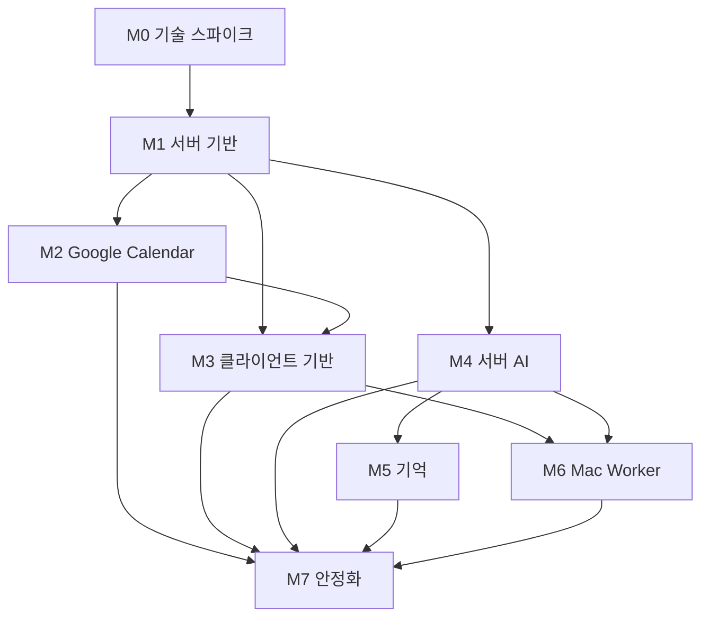

# Jimin OS 단계별 구현 명세

이 디렉터리의 문서는 일정표가 아니라 구현 계약이다. 각 단계는 선행조건, 범위, API·데이터·이벤트 계약, 실패 처리, 테스트, 완료 게이트를 충족해야 끝난다.

## 문서 목록

| 단계 | 문서 | 핵심 결과 |
|---|---|---|
| 공통 | [공통 구현 계약](SHARED_CONTRACTS.md) | API, ID, 시간, 오류, 동기화, 보안, 테스트 규칙 |
| M0 | [배포·기술 스파이크](M0_DEPLOYMENT_SPIKE.md) | 배포 가능한 최소 수직 구조와 기술 선택 확정 |
| M1 | [서버 기반](M1_SERVER_FOUNDATION.md) | 인증된 API, PostgreSQL, session, sync 기반 |
| M2 | [Google Calendar](M2_GOOGLE_CALENDAR.md) | 일정 양방향 동기화와 장애 복구 |
| M3 | [Mac·모바일 클라이언트](M3_CLIENTS.md) | Mac/실기기 UI, cache, offline queue, 재연결 |
| M4 | [서버 AI](M4_SERVER_AGENT.md) | Codex App Server, stream, job, 승인, 장애 격리 |
| M5 | [기억 시스템](M5_MEMORY.md) | 출처·유효성·변경 이력이 있는 기억 검색 |
| M6 | [Mac Worker](M6_MAC_WORKER.md) | 승인된 로컬 파일·명령 실행 노드 |
| M7 | [안정화·릴리스](M7_HARDENING_RELEASE.md) | CI/CD, backup/restore, 보안, 관찰성, rollback |

## 구현 순서와 의존성



단계는 번호 순서로 완료하되, 계약이 고정된 뒤에는 다음 준비 작업을 병렬로 진행할 수 있다. 예를 들어 M1 API schema가 고정되면 M2 서버 작업과 M3 UI shell을 함께 진행할 수 있다. 완료 선언은 해당 단계의 모든 게이트가 통과한 뒤에만 한다.

## 명세 변경 절차

1. 구현 중 명세와 다른 요구를 발견한다.
2. 코드보다 명세를 먼저 수정한다.
3. 보안, 데이터 소유권, 프로토콜 경계가 달라지면 `docs/adr/`에 ADR을 추가한다.
4. API 또는 DB 변경이면 schema와 migration 전략을 함께 수정한다.
5. 완료 게이트와 테스트가 새 동작을 검증하도록 갱신한다.
6. 그다음 구현한다.

## 단계 시작 조건

- 선행 단계의 완료 게이트가 통과했다.
- 필요한 외부 계정, 테스트 기기, 서버 접근이 준비됐다.
- 해당 단계의 OpenAPI, DB schema, event 계약 초안이 리뷰됐다.
- 비밀정보 저장 위치와 로그 마스킹 범위가 정해졌다.
- 수동 검증 시나리오를 실행할 기기가 정해졌다.
- 범위 밖 항목이 backlog로 분리됐다.

## 공통 완료 정의

모든 단계는 아래 항목을 공통으로 만족해야 한다.

### 구현

- 명세의 필수 범위가 코드에 반영됐다.
- formatter, lint, typecheck, unit/integration test가 통과한다.
- API 변경은 실제 route와 OpenAPI가 일치한다.
- DB 변경은 migration과 빈 DB 재구축 테스트가 있다.
- 사용자 상태에는 loading, empty, error, offline, retry가 필요한 만큼 구현됐다.

### 안전성

- 하드코딩된 secret이 없다.
- 로그에 token, 일정 본문, 메시지 원문, 파일 내용이 불필요하게 남지 않는다.
- 인증 endpoint와 권한 guard가 테스트됐다.
- 재시도해도 중복 쓰기·중복 명령이 발생하지 않는다.
- 실패 중간 상태에서 복구 경로가 있다.

### 검증

- 자동 테스트 결과를 남긴다.
- 단계 명세의 수동 시나리오를 실행한다.
- Mac과 개인 휴대폰이 관련된 단계는 실기기 증거를 남긴다.
- 서버 배포 단계는 staging health와 rollback 가능성을 확인한다.
- OpenDock backend/design/UX writing gate 중 변경 범위에 해당하는 gate를 통과한다.

### 문서

- 운영 명령과 환경 변수가 문서화됐다.
- 알려진 제한과 후속 backlog가 기록됐다.
- 사용자에게 보이는 용어와 오류 문구가 `WRITING.md`, `TERMS.md`와 일치한다.
- 구현이 아키텍처 경계를 바꾸면 상위 계획서와 ADR도 갱신됐다.

## 완료 증거 형식

각 단계 완료 시 PR 또는 작업 보고에 다음을 남긴다.

```text
Stage:
Implemented:
Schema or migration changes:
Automated checks:
Manual Mac verification:
Manual phone verification:
Security checks:
Known limitations:
Gate result: PASS | FAIL
```

## 범위 관리 원칙

- 일정 조회가 AI 기능보다 우선한다.
- Agent 장애가 일정·할 일 API를 중단시키면 안 된다.
- Mac Worker가 없어도 서버 AI와 개인 데이터 기능은 동작해야 한다.
- 개인용 단일 사용자 요구를 먼저 만족하고 다중 사용자 추상화를 미리 만들지 않는다.
- FTS로 검증하기 전에 별도 vector database를 도입하지 않는다.
- private network 운영이 검증되기 전에 public relay를 만들지 않는다.
- 승인 흐름이 완성되기 전에 자율 실행을 허용하지 않는다.
